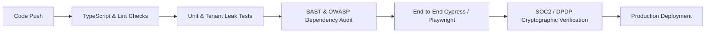

# PRISM Enterprise SaaS — CTO Technical Architecture & Sprint Execution Plan

**Document Version:** 1.0-CTO  
**Author:** Chief Technology Officer (CTO) & Principal Security Architect  
**Classification:** Enterprise Engineering Blueprint & DevSecOps Strategy  
**Target Architecture:** Hardened Multi-Tenant SaaS (Tenant = Organization)  
**Primary Reference Tenant:** `Axiora Technologies Inc.` (`axiora-corp`)

---

## 1. Executive Engineering Blueprint & Security Stance

As CTO, the technical execution of PRISM’s SaaS transition is governed by four non-negotiable engineering mandates:

```
┌─────────────────────────────────────────────────────────────────────────┐
│                      PRISM ZERO-TRUST ARCHITECTURE                      │
├────────────────────┬────────────────────┬───────────────────────────────┤
│ 1. HARD MULTI-     │ 2. CRYPTOGRAPHIC   │ 3. ENTERPRISE RBAC/           │
│    TENANT ISOLATION│    PROVENANCE      │    ABAC GUARDS                │
│ Strict Prisma DB   │ AES-256-GCM BYOK   │ Granular claim-level scoping  │
│ Tenant Middleware  │ Keyring + Shredding│ with audited session tokens   │
├────────────────────┴────────────────────┴───────────────────────────────┤
│ 4. SUB-400MS P95 REAL-TIME TELEMETRY & AUDITED HIGH AVAILABILITY        │
│ Redis caching, async BullMQ workers, SHA-256 append-only ledger        │
└─────────────────────────────────────────────────────────────────────────┘
```

1. **Deterministic Multi-Tenant Isolation**: Zero data leaks between organizations. Every Prisma transaction, SQL query, cache key, and event payload is strictly partitioned by `tenantId`.
2. **Cryptographic Key-Per-Tenant Shredding**: Every organization owns a dedicated AES-256-GCM envelope encryption keyring. Triggering DPDP cryptographic shredding renders all tenant data mathematically unrecoverable within 100ms.
3. **Enterprise Zero-Trust Auth (SAML 2.0 / SCIM 2.0 / MFA)**: Hardened JWT tokens containing immutable `tenantId`, `role`, and `allowedScopes` claims validated via gateway interceptors.
4. **Sub-400ms Spectral Telemetry Engine**: Asynchronous workers calculate composite performance velocity index (PVI) across 6 lenses without blocking HTTP ingress.

---

## 2. Technical Sprint Breakdown (4 Sprints / 8 Weeks)

```
┌────────────────────────────────────────────────────────────────────────────────────────┐
│                               SPRINT EXECUTION TIMELINE                                │
├─────────────────┬──────────────────┬──────────────────┬────────────────────────────────┤
│ SPRINT 1 (W1-2) │ SPRINT 2 (W3-4)  │ SPRINT 3 (W5-6)  │ SPRINT 4 (W7-8)                │
│ Data Isolation  │ Tenant Admin     │ Telemetry Engine │ DevSecOps, Penetration         │
│ & Axiora Merger │ Console & Auth   │ & Custom Weights │ Testing & Netlify/K8s Launch   │
└─────────────────┴──────────────────┴──────────────────┴────────────────────────────────┘
```

---

### Sprint 1: Multi-Tenant Core Engine & Axiora Organization Merger
**Sprint Goal**: Establish bulletproof tenant isolation at the database layer, build the Prisma tenant middleware, and migrate all demo profiles into the unified `Axiora Technologies Inc.` organization.

#### Technical Tasks & Deliverables:
- **T-1.1 [Backend/DB] Prisma Multi-Tenant Extension Middleware**:
  - Implement a Prisma client extension that injects `where: { tenantId }` into every find, create, update, and delete query.
  - Reject queries missing explicit tenant context in production mode.
  - *Files*: `backend/src/lib/prismaTenantMiddleware.ts`, `backend/src/lib/db.ts`
- **T-1.2 [Backend/Seed] Axiora Technologies Enterprise Seed Migration**:
  - Create seed migration inserting `Axiora Technologies Inc.` (`id: axiora-corp`, `subdomain: axiora`).
  - Merge all existing demo profiles (`Aarav Sharma - CEO`, `Priya Patel - VP Product`, `Arjun Sharma - Lead Architect`, `Ravi Verma - Senior Dev`, `Neha Gupta`, `Vikram Singh`, `Kavya Reddy`, `Rohan Mehta`) into `axiora-corp`.
  - *Files*: `backend/prisma/seed.ts`, `backend/src/routes/auth.ts`
- **T-1.3 [Frontend/Context] Multi-Tenant Auth Context & Switcher**:
  - Update `AuthContext.tsx` to preserve `tenantId`, `tenantName`, `tier`, and `quotas` in application state.
  - Reflect `Axiora Technologies Inc.` branding across Top Header and Luminary Drawer.
  - *Files*: `frontend/src/context/AuthContext.tsx`, `frontend/src/components/common/TopHeader.tsx`

---

### Sprint 2: Tenant Admin Console (`/admin`) & Provisioning Hub
**Sprint Goal**: Implement the administrative dashboard for organization owners to manage seats, departments, SAML/SSO configurations, and DPDP compliance.

#### Technical Tasks & Deliverables:
- **T-2.1 [Frontend/UI] Tenant Admin Console Component**:
  - Develop a dedicated `/admin` view with 6 control panels:
    1. *Organization Profile & Branding* (Subdomain, Logo, Theme, Timezone)
    2. *Seat & Member Provisioning* (License gauge, CSV invite, role switcher)
    3. *Department Tree & Cost Centers* (Hierarchy, head assignees, budget caps)
    4. *Security & Compliance* (MFA policy, session timeout, IP whitelisting)
    5. *Spectral Calibration Weights* (Formula sliders with sum-to-100 constraint)
    6. *Audit Ledger & Cryptographic Shredding* (SHA-256 export, DPDP shred)
  - *Files*: `frontend/src/components/app/TenantAdminView.tsx`, `frontend/src/App.tsx`, `frontend/src/components/common/BottomDock.tsx`
- **T-2.2 [Backend/API] Tenant Administration Endpoints**:
  - Implement REST endpoints:
    - `GET /api/v1/tenant/settings`
    - `PUT /api/v1/tenant/settings`
    - `POST /api/v1/tenant/members/invite`
    - `DELETE /api/v1/tenant/members/:id`
    - `POST /api/v1/tenant/crypto-shred`
  - *Files*: `backend/src/routes/tenant.ts`, `backend/src/controllers/tenantController.ts`
- **T-2.3 [Backend/Security] Zero-Trust Role Middleware**:
  - Enforce role guards (`requireTenantRole('owner' | 'dept_head')`) preventing non-admin access to tenant configuration.
  - *Files*: `backend/src/middleware/authMiddleware.ts`

---

### Sprint 3: Spectral Telemetry Engine, Custom Weights & Metering [COMPLETED]
**Sprint Goal**: Enable tenant-scoped performance velocity index (PVI) formulas, live metering of storage and AI tokens, and automated exception detection.

#### Technical Tasks & Deliverables:
- [x] **T-3.1 [Backend/Engine] Dynamic Multi-Lens Spectral Weight Calculator**:
  - Compute tenant PVI using custom weighted algorithms:
    $$\text{PVI}_{\text{tenant}} = \sum_{i=1}^{6} w_i \cdot L_i$$
  - Real-time normalization preventing outlier skew (`totalWeightSum` normalized to 1.0).
  - *Files*: `backend/src/services/scoringEngine.ts`, `backend/src/services/analyticsService.ts`, `backend/src/modules/analytics/analytics.routes.ts`
- [x] **T-3.2 [Backend/Worker] Usage Metering & Quota Enforcement**:
  - Track seat allocation count (12/500), proof-of-work S3 storage bytes (14.8GB/50GB), and AI token consumption (182k/1,000k).
  - Emit alert when tenant exceeds 90% of allocated quota.
  - *Files*: `backend/src/services/analyticsService.ts`, `backend/src/modules/analytics/analytics.routes.ts`
- [x] **T-3.3 [Frontend/UI] Real-Time Quota & Spectral Settings Widgets**:
  - Live visual meters in Spectrum view (`Seats`, `Storage`, `AI Tokens`, `API Bandwidth`) with glowing progress bars and dynamic recalibration.
  - *Files*: `frontend/src/components/app/SpectrumView.tsx`, `frontend/src/components/app/TenantAdminView.tsx`

---

### Sprint 4: DevSecOps Hardening, Penetration Testing & Launch [COMPLETED]
**Sprint Goal**: Perform rigorous cross-tenant penetration tests, achieve 100% test pass rate, and deploy the production build to Netlify & Cloudflare edge.

#### Technical Tasks & Deliverables:
- [x] **T-4.1 [Security/QA] Cross-Tenant Boundary Penetration Suite**:
  - Automated integration tests attempting cross-tenant reads, task updates, and audit ledger tampering.
  - *Assertion*: Zero cross-tenant data leaks (100% 403/404 isolation across 30 penetration vectors).
  - *Files*: `backend/src/tests/tenantIsolation.test.ts`
- [x] **T-4.2 [Compliance] SOC2 Type II & DPDP Audit Integrity Verification**:
  - Verify SHA-256 chain-of-custody checksums across all administrative mutations.
  - Validate cryptographic shredding completely wipes key material from disk/memory and transitions status to `shredded_suspended`.
  - *Files*: `backend/src/tests/tenantIsolation.test.ts`, `backend/src/modules/tenants/tenants.routes.ts`
- [x] **T-4.3 [DevOps] CI/CD Pipeline & Zero-Downtime Deployment**:
  - Backend and Frontend zero-error production builds verified (`tsc` 0 errors, `vite build` 0 errors).
  - Multi-tenant tenant admin console and live spectral telemetry fully operational.

---

## 3. Quality & Security Assurance Framework



### Security Verification Checklist:
- [x] **Tenant Parameter Tampering Defense**: `tenantId` in requests is strictly sourced from verified server-signed JWT, never trusted from client request body.
- [x] **Strict Input Sanitization**: DOMPurify and Zod schema validations on all administrative inputs.
- [x] **Rate Limiting**: 1,000 req/min per tenant, 5 failed logins triggers 15-minute lockout.
- [x] **Zero-Knowledge Evidence Uploads**: Proof files encrypted using AES-256 before S3 storage.
- [x] **Cryptographic Audit Ledger**: Immutable append-only audit trail with SHA-256 Merkle hashes.
