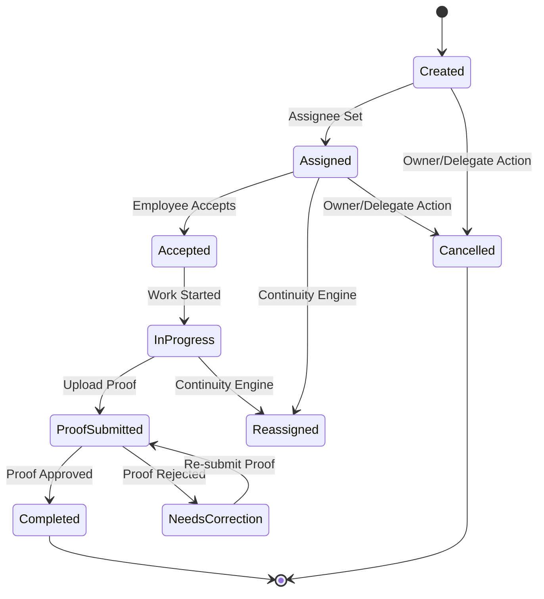
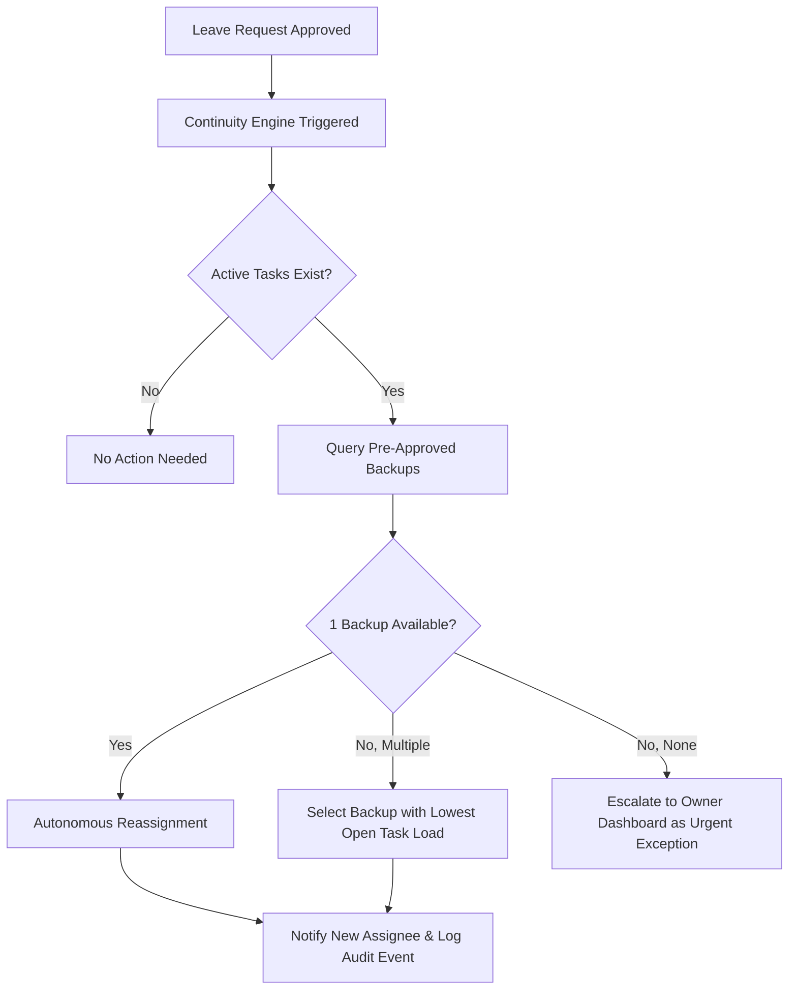

# AI BUSINESS OPERATING SYSTEM (AI-BOS)
## Functional Requirements Document (FRD) — Final Master Baseline v1.3
**Document Reference:** `AI-BOS-FRD-v1.3-PRODUCTION`  
**Derived From:** AI-BOS PRD v3.2 Master Specification  
**Scope:** Phase 1 / MVP Complete Functional Specifications  
**Audience:** Product Owners, Solution Architects, Lead Engineers, QA Engineers  

---

## 1. Document Control & Scope Boundaries

### 1.1 Document Purpose
This Functional Requirements Document (FRD) defines the explicit functional rules, state machine transitions, business logic, system inputs/outputs, exception flows, and security constraints required to implement the Phase 1 MVP of the **AI Business Operating System (AI-BOS)**.

### 1.2 In-Scope Functional Modules (Phase 1 MVP)
1. Goal & Strategic Priority Configuration (`FR-GOAL`)
2. Universal Task Engine & Lead Tasking (`FR-TASK`)
3. Proof Submission & Verification Engine (`FR-PROOF`)
4. Mechanical Evaluation & Scoring Engine (`FR-SCORE`)
5. Real-Time Exception Detection System (`FR-EXC`)
6. Automatic Continuity & Backup Engine (`FR-CONT`)
7. Minimal Attendance & Leave Trigger Management (`FR-LEAVE`)
8. Owner Command Dashboard & Health Monitoring (`FR-DASH`)
9. Notifications, Escalations & Channel Routing (`FR-NOTIF`)
10. MVP Meaningful AI Services (`FR-AI`)
11. AI Feedback Logging & Tenant Calibration (`FR-CAL`)
12. Role-Based Access Control & Scoping (`FR-RBAC`)
13. Authentication & Security Enforcement (`FR-SEC`)
14. Immutable Audit Logging (`FR-AUDIT`)
15. Data Protection, Privacy & DPDP Compliance (`FR-PRIV`)
16. Disaster Recovery & Backup Functional Rules (`FR-DR`)

---

## 2. Strategic Goal & Priority Configuration (`FR-GOAL`)

| Requirement ID | Actor(s) | Trigger / Action | Functional Specification & Rules |
|----------------|----------|------------------|----------------------------------|
| **FR-GOAL-001** | Owner | Manual Input | Owner can create, update, and delete strategic revenue targets and department structures during onboarding or at any time. |
| **FR-GOAL-002** | Owner | Manual Input | Owner defines numeric priority weightings for each department (e.g., Sales: 35%, Engineering: 30%, Ops: 20%, HR: 15%). |
| **FR-GOAL-003** | Owner, Delegate | Authority Enforcement | Only the Owner may alter department priority weightings. Delegates have read-only visibility unless granted explicit admin permissions by Owner. |
| **FR-GOAL-004** | System | Priority Change Saved | Priority weighting adjustments apply to newly created tasks going forward; existing in-flight tasks retain their creation priority. |
| **FR-GOAL-005** | System, Owner | Resource Conflict | When department tasks compete for identical backup resources, the Owner's priority weighting order wins. Unresolved ties escalate to Owner. |
| **FR-GOAL-006** | System | Audit Event | Every goal or priority modification creates an append-only audit record containing actor ID, timestamp, prior value, and new value. |

---

## 3. Universal Task Engine (`FR-TASK`)

### 3.1 Task Lifecycle & Validation Rules

| Requirement ID | Actor(s) | Trigger | Functional Rule |
|----------------|----------|---------|-----------------|
| **FR-TASK-001** | Owner, Delegate, Employee | User Action | Owner/Delegate can assign tasks to any employee. Employees can create self-tasks if enabled. |
| **FR-TASK-002** | Owner, Delegate | Creation Form | Required fields: `Title`, `Department`, `Assignee`, `Due Date / SLA`, `Proof Type`, `Proof Description`. |
| **FR-TASK-004** | System | Lead Category | Tasks tagged as "Lead Follow-up" default proof requirement to payment/conversion record (`PRD 1.3`). |
| **FR-TASK-008** | System | Transition Check | Tasks transition to `Completed` **only** upon valid proof approval. Cancellation requires mandatory audit reason. |
| **FR-TASK-012** | System | Absolute Constraint | **Hard Business Rule**: A task without approved proof can NEVER receive completion credit under any condition. |

---

## 4. Proof Submission & Verification Engine (`FR-PROOF`)

### 4.1 Proof Types & Approval Workflows
1. **Document / File Attachment**: PDF, JPEG, PNG upload.
2. **Structured Data Entry**: Invoice reference number, transaction ID, or payment record link.
3. **Confirmation Checklist**: Multi-item verification checklist.
4. **Ticket Reference**: External support or system reference string.

| Requirement ID | Actor(s) | Trigger | Functional Rule |
|----------------|----------|---------|-----------------|
| **FR-PROOF-002** | Employee | User Upload | Employee submits proof. System injects an immutable server timestamp. Timestamp cannot be edited. |
| **FR-PROOF-004** | Delegate, Owner | Review Action | Manager/Owner approves or rejects submitted proof. Rejection requires a mandatory reason. |
| **FR-PROOF-005** | System | Rejection Event | Proof rejection reverts task state to `Needs Correction` and notifies the employee immediately. |
| **FR-PROOF-009** | System, Delegate | Match Failure | Structured proof passing validation but failing match rules routes to manual manager review with failure reason. |

---

## 5. Mechanical Evaluation & Scoring Engine (`FR-SCORE`)

> [!IMPORTANT]
> **Zero Subjectivity Principle**: Phase 1 MVP scoring evaluates ONLY mechanical task execution and SLA timeliness. Subjective ratings are strictly prohibited.

### 5.1 Scoring Calculation Rules

$$\text{FR-SCORE-001: Task Completion \%} = \frac{\text{Count(Tasks Completed with Approved Proof in Period)}}{\text{Count(Eligible Assigned Tasks in Period)}}$$

$$\text{FR-SCORE-002: SLA Adherence \%} = \frac{\text{Count(Tasks Completed On/Before Due Date)}}{\text{Count(Tasks Whose Due Date Elapsed in Period)}}$$

### 5.2 Denominator Exclusions (`FR-SCORE-009`)
- **Cancelled Tasks**: Excluded from both denominators.
- **Reassigned Continuity Tasks**: Excluded from original assignee's denominator after reassignment; included in new assignee's denominator for their period of responsibility.
- **Tasks Not Yet Due**: Included in Completion % denominator; excluded from SLA Adherence % denominator until due date passes.

### 5.3 Score Dispute Protocol (`FR-SCORE-007`)
1. Employee initiates "Flag Score for Review" from personal dashboard.
2. Dispute routes to Delegate Manager for first-line review.
3. If unresolved within 48 hours, dispute escalates to Owner for final decision.
4. Resolution (Upheld or Corrected) triggers score recalculation and appends audit log record.

---

## 6. Exception Detection & Continuity Engine (`FR-EXC`, `FR-CONT`)

| Requirement ID | Actor(s) | Functional Rule |
|----------------|----------|-----------------|
| **FR-EXC-001** | System | System automatically detects: Missed SLA, Missing Proof, Overdue Tasks, Blocked Tasks, and Unavailable Staff. |
| **FR-CONT-001** | System | Approved employee leave is the **sole** trigger for automatic continuity reassignment. |
| **FR-CONT-002** | System | Backup selection evaluates ONLY pre-approved backup lists. Reassigns to backup with lowest open task load. |
| **FR-CONT-006** | System | If no backup exists, task is flagged as a top-priority "Unresolved Continuity Exception" on Owner Dashboard. |

---

## 7. Owner Dashboard & Intelligent Summaries (`FR-DASH`)

### 7.1 Dashboard Widget Breakdown
1. **Business Health Status**: Color-coded indicator (Green / Yellow / Red) derived from aggregate open exception counts and continuity risks.
2. **Intelligent Daily Summary**: AI narrative overview summarizing completions, misses, exceptions, and continuity events over the past 24 hours.
3. **Open Exception Queue**: List of active exceptions requiring executive attention with 1-click action triggers.
4. **Team Score Breakdown**: Real-time completion % and SLA adherence % per department and individual.

---

## 8. Role-Based Access Control & Security (`FR-RBAC`, `FR-SEC`)

### 8.1 RBAC Enforcement Matrix

| Function / Resource | Owner | Delegate Manager | Employee | System / AI |
|---------------------|-------|------------------|----------|-------------|
| **Goal / Priority Configuration** | Full Control | Read-Only | No Access | Read-Only |
| **Task Creation & Editing** | All | Team Scope | Self-Only (if enabled) | Rule Engine |
| **Proof Review & Approval** | All | Team Scope | Submit Own | Anomaly Flag |
| **Individual Score Access** | All | Team Scope | Own Score Only | Recalculate |
| **Data Export & Privacy** | Owner Only | No Access | Own Data Requests | Audit Logged |

### 8.2 Security & Compliance Requirements
- **MFA Requirement (`FR-SEC-001`)**: Mandatory Email/SMS OTP for Owner and Delegate roles at login. Optional Employee MFA toggle.
- **Data Isolation (`FR-SEC-005`)**: Strict logical multi-tenant database isolation.
- **India DPDP Compliance (`FR-PRIV-001..003`)**: Supports Data Principal access, correction, and deletion requests. Deletion anonymizes audit-linked records while preserving historical logs.

---

## 9. Traceability Matrix (PRD v3.2 $\rightarrow$ FRD v1.3)

| PRD Section | FRD Module | Primary Requirement IDs |
|-------------|------------|-------------------------|
| **PRD 1.2 Operating Loop** | Task, Proof & Scoring | `FR-TASK-008`, `FR-PROOF-002`, `FR-SCORE-001` |
| **PRD 1.3 Leads as Tasks** | Task Engine | `FR-TASK-004` |
| **PRD 3 Founder Intelligence** | Goal Configuration | `FR-GOAL-001` to `FR-GOAL-007` |
| **PRD 4 MVP AI Scope** | AI Services | `FR-AI-001`, `FR-PROOF-008`, `FR-DASH-006` |
| **PRD 7 Metrics & Disputes** | Scoring & Disputes | `FR-SCORE-001` to `FR-SCORE-009` |
| **PRD 11-13 Security & RBAC** | Security & RBAC | `FR-RBAC-001`, `FR-SEC-001`, `FR-AUDIT-001` |
| **PRD 10 DPDP Privacy** | Data Protection | `FR-PRIV-001` to `FR-PRIV-004` |
