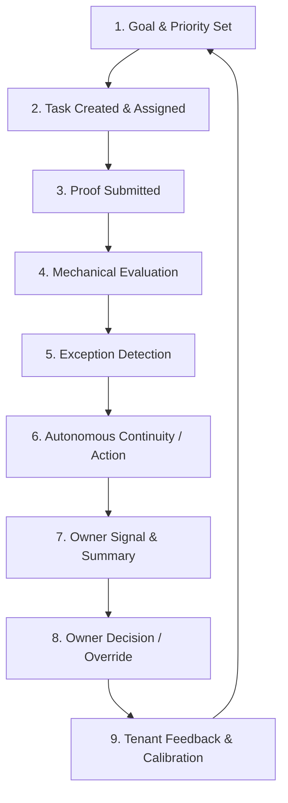
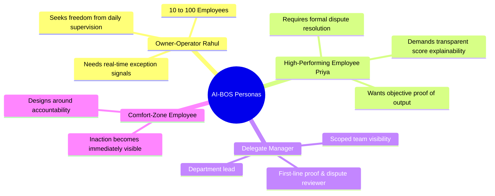
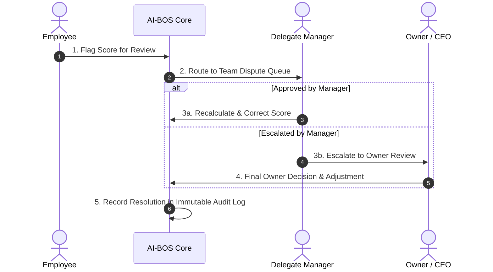

# AI BUSINESS OPERATING SYSTEM (AI-BOS)
## Product Requirements Document (PRD) — Final Master Release v3.2
**Tagline:** *Run Your Business. Live Your Life.*  
**Author:** Senior Business Analyst, Lead Product Owner & Global Product Architect  
**Status:** Locked & Approved Baseline (Phase 1 / MVP Production Ready)  
**Target Market:** India SMBs & Global High-Growth Businesses (10–100 Employees)  

---

> [!IMPORTANT]
> **Core Operating Philosophy**: A business stops functioning correctly the moment the owner stops personally watching it. AI-BOS solves this root problem by replacing physical owner presence with a closed, proof-based accountability and automatic work continuity loop.

---

## 1. Executive Summary & Core Product Loop

### 1.1 The One Problem AI-BOS Solves
Every business vulnerability — lost leads, unverified work reporting, dropped tasks during employee leave, and low accountability — is a symptom of owner dependency. AI-BOS transforms daily business effort into proof-backed outcomes, ensuring operational continuity whether the owner is in the office or away for a month.

### 1.2 The Closed-Loop Operating Engine
AI-BOS is not a static dashboard; it is an active operating system where human decisions and autonomous rules feed back to calibrate future platform behavior.



### 1.3 Stage Responsibility & Autonomy Boundaries

| Stage | Responsibility Type | Execution Mechanism | Human vs. System Boundary |
|-------|---------------------|---------------------|---------------------------|
| **1. Goal/Priority Set** | Owner Input | Manual configuration during onboarding & ongoing adjustments | Owner sets strategic department priorities & revenue goals |
| **2. Task Assigned** | Rule-Based | Driven by department weighting & task templates | Automated creation; manual override permitted |
| **3. Proof Submitted** | Employee Action | Attachments, structured references, checklists, IDs | Employee uploads verifiable proof of work |
| **4. Evaluation** | Mechanical / Autonomous | Real-time calculation of Completion % and SLA Adherence % | 100% mechanical calculation; zero human subjective scoring |
| **5. Exception Detection** | Autonomous | System flags missed SLAs, missing proof, and leave risks | Automatic detection; severity classification |
| **6. Continuity Action** | Autonomous / Recommends | Reassigns tasks to pre-approved backups with lowest workload | Reassigns autonomously if pre-approved backup exists; escalates if none |
| **7. Owner Signal** | Informational | Intelligent Daily Summary & exception alerts | Real-time dashboard & WhatsApp/email digest |
| **8. Owner Decision** | Human Oversight | Executive approval, score dispute resolution, override | **Human-only zone** — employment decisions remain 100% human |
| **9. Feedback / Calibration** | Continuous Learning | Logs owner overrides to calibrate tenant sensitivity | Adjusts per-tenant scoring/flagging parameters |

---

## 2. Product Scope & Strategic Differentiation

### 2.1 Scope Simplification: "Leads Are Tasks"
To eliminate multi-tool fragmentation, AI-BOS treats every lead follow-up as a universal task with a strict SLA and a required proof element (e.g., invoice reference, payment confirmation, or CRM conversion record). There is no separate lead CRM pipeline in Phase 1 MVP.

### 2.2 What "Founder Mindset Replication" Means
AI-BOS captures explicit, founder-defined parameters — revenue goals, team structure, department priority weighting, and role definitions. It uses these explicit rules and owner override logs to calibrate recommendations per tenant. It does *not* attempt to simulate tacit human psychology.

### 2.3 Key Competitive Moat & Differentiators

```
┌────────────────────────────────────────────────────────────────────────┐
│                        AI-BOS COMPETITIVE MOAT                         │
├────────────────────────────────────────────────────────────────────────┤
│ 1. Uniform Proof-Gated Evaluation across all departments               │
│ 2. Zero-Drop Task Continuity (automatic backup reassignment)           │
│ 3. Single Owner Priority System driving overall score weighting        │
│ 4. Closed Feedback Loop calibrating AI recommendations per tenant      │
│ 5. Full Compliance with India DPDP Act 2023 / Rules 2025               │
└────────────────────────────────────────────────────────────────────────┘
```

> [!TIP]
> **Out-of-Scope Commodity AI**: AI ad generation, generic marketing copy, call sentiment analysis, and CCTV video processing are commodity features deferred to Phase 2/3. They do not form the core Phase 1 moat.

---

## 3. Minimum Meaningful AI Integration in MVP

To ensure AI-BOS earns its brand promise while maintaining absolute mechanical reliability, Phase 1 MVP incorporates exactly two high-value, low-risk AI capabilities:

### 3.1 Capability 1: Proof Anomaly Flagging (Recommends Tier)
- **Purpose**: Detects duplicate proof uploads, rapid invalid submissions, or submission patterns inconsistent with employee history.
- **Behavior**: Attaches an advisory warning flag to the proof review queue. It **never** alters or degrades an employee's score automatically; a human manager/owner must review and accept or dismiss the flag.

### 3.2 Capability 2: Intelligent Daily Business Summary (Informational Tier)
- **Purpose**: Synthesizes the day's core loop activity (completed tasks, missed SLAs, continuity events, and unresolved exceptions) into a concise, readable narrative for the owner.
- **Behavior**: Delivered via dashboard and WhatsApp/Email digests. Purely informational; presents no automated commands and triggers no background state changes.

---

## 4. Personas & Target User Profiles



---

## 5. Metrics, Cross-Department Fairness & Dispute Architecture

### 5.1 Mechanical Scoring Formulas

$$\text{Task Completion \%} = \frac{\text{Tasks Completed with Approved Proof}}{\text{Eligible Assigned Tasks}}$$

$$\text{SLA Adherence \%} = \frac{\text{Tasks Completed Within Due Date}}{\text{Total Tasks Past Due Date}}$$

### 5.2 Fair Denominator Rules
1. **Cancelled Tasks**: Excluded from all scoring denominators for all parties (cancellation is an owner/manager action, not an employee failure).
2. **Reassigned Tasks (Continuity)**: Excluded from original assignee's denominator from the point of reassignment forward; included in backup assignee's denominator only for their period of ownership.
3. **Tasks Not Yet Due**: Included in Completion % denominator, but excluded from SLA Adherence % denominator until the due date passes.

### 5.3 Non-Revenue Department Fairness
Non-revenue departments (HR, Engineering, Operations, Admin) are evaluated strictly on Task Completion %, SLA Adherence %, and Direction Alignment. They are **never** penalized or scored as zero for lacking direct revenue attribution metrics.

### 5.4 Formally Audited Score Dispute Path



---

## 6. Permissions, RBAC & Security Baseline

### 6.1 Role-Based Access Control (RBAC) Matrix

| Feature / Data Scope | Owner (CEO) | Delegate (Manager) | Employee | System / AI |
|----------------------|-------------|-------------------|----------|-------------|
| **Business Goals & Priority Weighting** | Full Control | Read-Only | No Access | Read-Only |
| **Task Creation & Assignment** | All Departments | Team Scope | Self-Only (if enabled) | Automated Rules |
| **Proof Review & Approval** | All Proofs | Team Proofs | Submit Own Proof | Anomaly Flagging |
| **Individual Score Visibility** | All Employees | Team Scope | Own Score Only | Calculation Engine |
| **Score Dispute Resolution** | Final Escalation | First-Line Review | Initiate Dispute | Audit Logging |
| **Data Export & Privacy Requests** | Full Authority | No Access | Own Data Requests | Logged Execution |
| **MFA Enforceability** | Mandatory (OTP) | Mandatory (OTP) | Optional (Org Toggle) | N/A |

### 6.2 Security & Compliance Architecture
- **Data Protection Compliance**: Built for India **DPDP Act 2023 / Rules 2025** compliance. Data processing grounded in "legitimate use".
- **Tenant Isolation**: Strict logical database separation. No cross-tenant data leakage under any query condition.
- **Audit Log Immutability**: All permissions, scoring changes, proof rejections, and AI overrides are written to append-only logs.
- **Backup & Disaster Recovery**: RPO $\le$ 24 hours, RTO $\le$ 4 hours. Deletion requests propagate to live systems and backups within defined compliance windows.

---

## 7. Phased Product Roadmap

```text
Phase 1: MVP (The Operating Loop) — CURRENT RELEASE
├── Task Engine (Leads as Tasks) & Proof Verification
├── Mechanical Scoring (Completion % & SLA Adherence %)
├── Continuity Engine (Zero-Drop Backup Reassignment)
├── Owner Dashboard & Intelligent Daily Summary
└── Mandatory MFA, RBAC & DPDP Privacy Baseline

Phase 2: Growth & Advanced Analytics (Q1 2027)
├── Quality Scoring & Direct Revenue Attribution Models
├── WhatsApp Conversational Task Creation & Status Query
├── Social & Marketing API Integrations
└── Multi-Tenant Calibration & Learning Improvements

Phase 3: Autonomous Business Operations (Q3 2027)
├── Predictive Workforce Forecasting & Replacement Advisory
├── Retail Intelligence & CCTV Safety Integration
└── Enterprise Single Sign-On (SSO) & Advanced DLP
```

---

## 8. Final Product Statement
> **AI-BOS runs a closed-loop, proof-based accountability and continuity system — from owner-set goals through task execution, exception handling, and continuity, back to owner decisions that calibrate the system over time — keeping a business functioning whether the owner is present or not.**
