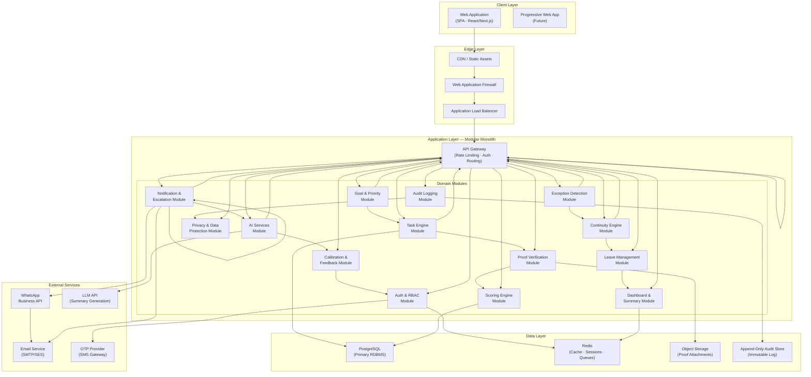
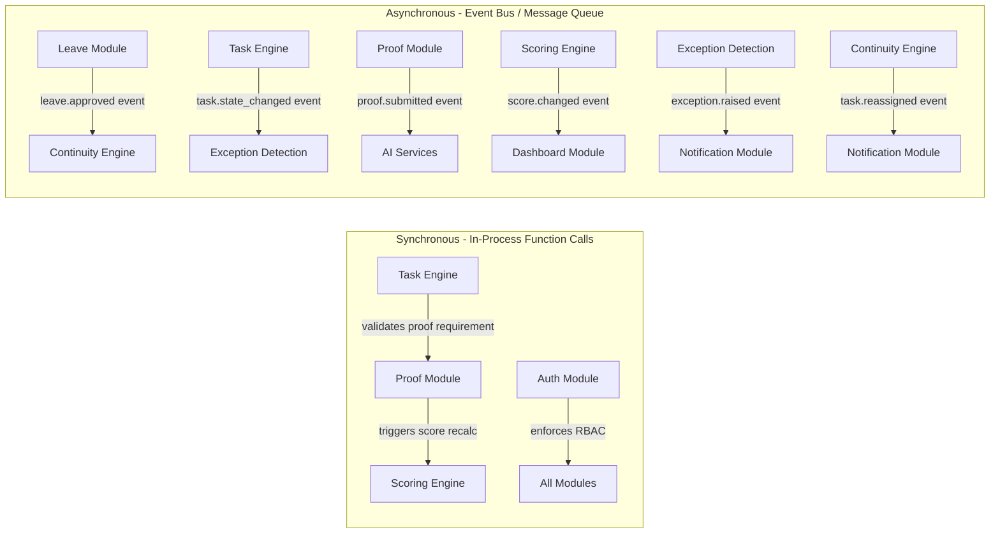
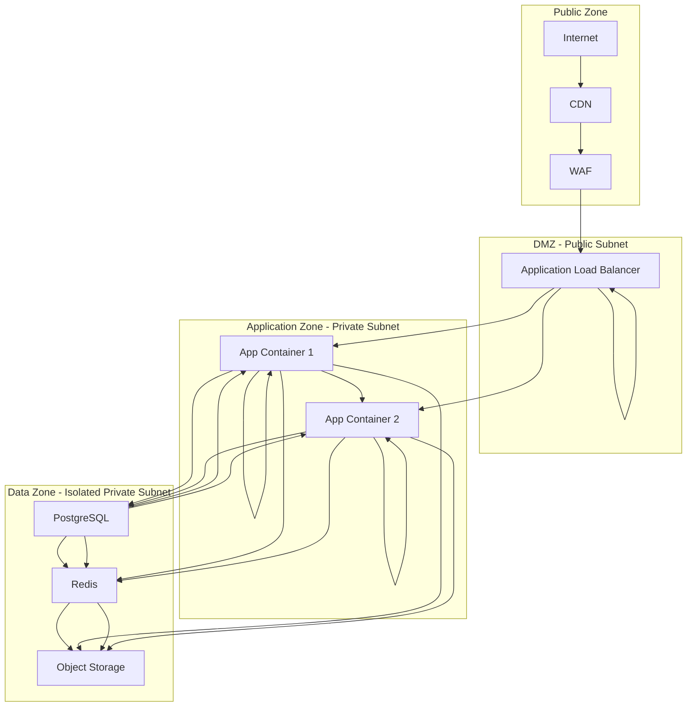
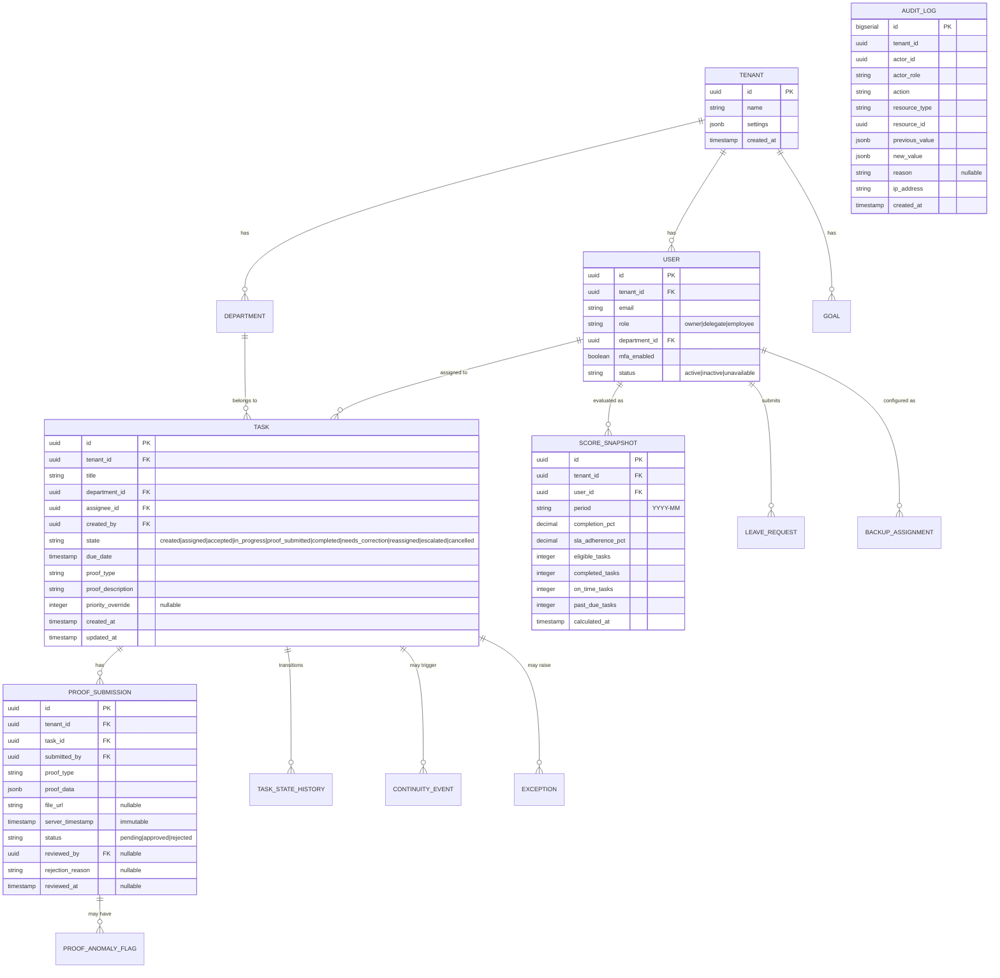
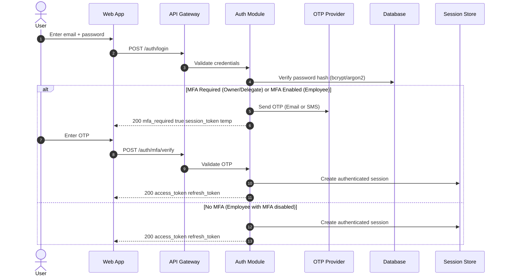
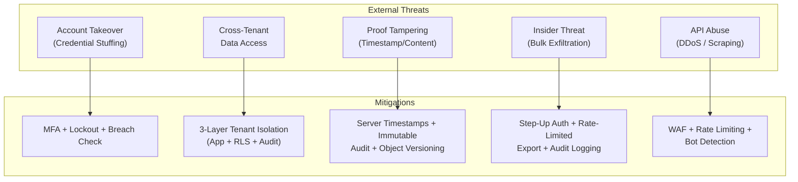
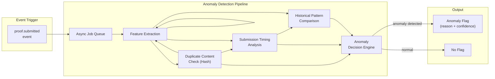
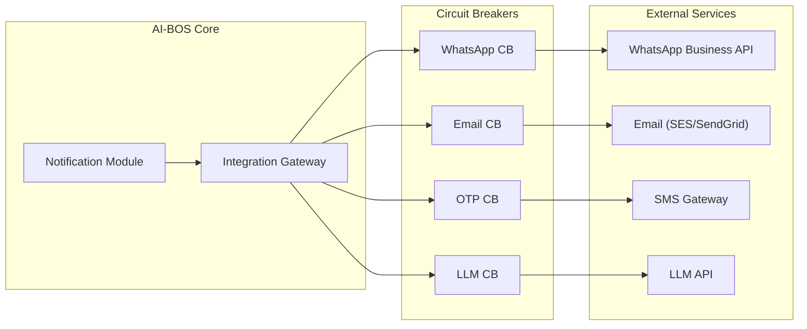
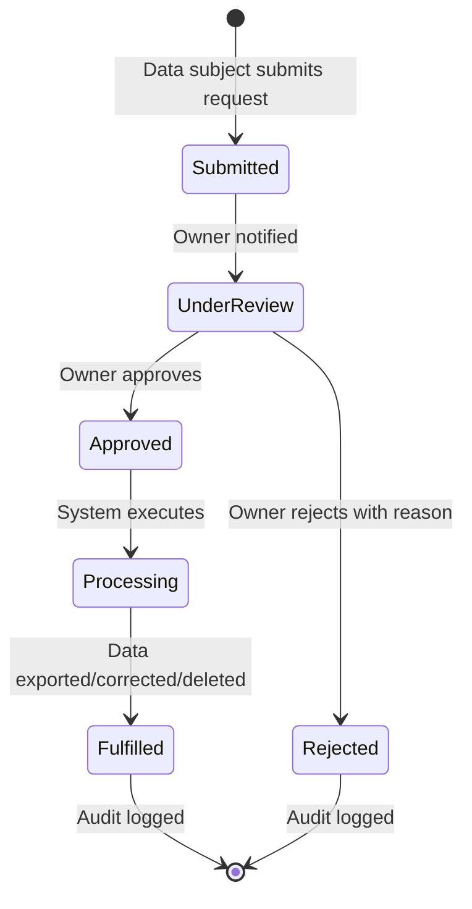

# AI BUSINESS OPERATING SYSTEM (AI-BOS)
## Technical Requirements Document (TRD) — v1.0
**Tagline:** *Run Your Business. Live Your Life.*  
**Author:** Global CTO & Chief Security Architect  
**Status:** Baseline for Architecture Review  
**Scope:** Phase 1 / MVP — Complete Technical Specification  
**Derived From:** PRD v3.2 Master Specification · FRD v1.3 Final Corrected Baseline  
**Target Deployment Region:** India (Primary), with multi-region expansion capability  

---

> [!IMPORTANT]
> **Governing Technical Principle**: Every technical decision in this document is evaluated against three non-negotiable constraints derived from the PRD/FRD: (1) **Proof-gated accountability** — no system path may grant completion credit without approved proof, (2) **Zero-drop continuity** — no task may be silently abandoned during employee absence, and (3) **Tenant isolation** — no data pathway may expose one tenant's data to another under any condition, including error states.

---

## Table of Contents

1. [Document Control & Traceability](#1-document-control--traceability)
2. [System Architecture & Design Principles](#2-system-architecture--design-principles)
3. [Infrastructure & Cloud Architecture](#3-infrastructure--cloud-architecture)
4. [Database Architecture & Data Model](#4-database-architecture--data-model)
5. [API Architecture & Service Design](#5-api-architecture--service-design)
6. [Authentication & Identity Management](#6-authentication--identity-management)
7. [Security Architecture](#7-security-architecture)
8. [AI/ML Pipeline Architecture](#8-aiml-pipeline-architecture)
9. [Integration Architecture](#9-integration-architecture)
10. [Observability, Monitoring & Alerting](#10-observability-monitoring--alerting)
11. [Performance & Scalability](#11-performance--scalability)
12. [Disaster Recovery & Business Continuity](#12-disaster-recovery--business-continuity)
13. [DevOps & CI/CD Pipeline](#13-devops--cicd-pipeline)
14. [Data Protection & DPDP Compliance Technical Implementation](#14-data-protection--dpdp-compliance-technical-implementation)
15. [Technology Stack Recommendations](#15-technology-stack-recommendations)
16. [Traceability Matrix (FRD → TRD)](#16-traceability-matrix-frd--trd)
17. [Open Technical Decisions](#17-open-technical-decisions)

---

## 1. Document Control & Traceability

### 1.1 Document Purpose

This Technical Requirements Document (TRD) translates every functional requirement in the FRD v1.3 and every product constraint in the PRD v3.2 into actionable technical specifications. It defines the **how** — the architecture, infrastructure, data models, API contracts, security controls, operational procedures, and technology choices — required to implement the AI-BOS Phase 1 MVP.

### 1.2 Audience

| Role | Use of This Document |
|------|---------------------|
| **Solution Architects** | Primary reference for system design and component interaction |
| **Lead Engineers (Backend/Frontend/DevOps)** | Technical constraints, API contracts, schema design, deployment topology |
| **Security Engineers** | Encryption standards, access control implementation, threat model |
| **QA Engineers** | Non-functional test criteria, performance targets, failure mode expectations |
| **Compliance Officers** | DPDP Act 2023 technical implementation details |
| **Product Owners** | Technical feasibility confirmation and constraint awareness |

### 1.3 Scope Boundaries

| In Scope (This Document) | Out of Scope |
|---------------------------|-------------|
| System architecture, component design, data flow | UI/UX wireframes and visual design specifications |
| Database schema principles, indexing strategy | Exact column-level DDL (deferred to design phase) |
| API contract structure and versioning strategy | Individual endpoint request/response schemas |
| Security architecture, encryption, key management | Penetration test reports and vulnerability remediation |
| Infrastructure topology and cloud service selection | Vendor commercial negotiations |
| CI/CD pipeline design and deployment strategy | Sprint-level implementation planning |
| AI/ML pipeline architecture for MVP capabilities | Model training datasets and hyperparameter tuning |
| Phase 2/3 technical considerations | Phase 2/3 detailed technical specifications |

---

## 2. System Architecture & Design Principles

### 2.1 Architectural Style

AI-BOS MVP adopts a **modular monolith** architecture with clearly defined domain boundaries, designed for future decomposition into microservices as scaling demands emerge.

**Rationale**: A modular monolith provides the deployment simplicity, transactional consistency, and developer velocity appropriate for a 6-month MVP build targeting 10–100 employee businesses, while the internal module boundaries ensure a non-disruptive migration path to microservices when Phase 2 multi-tenant scale requires it.



### 2.2 Core Design Principles

| # | Principle | Derived From | Technical Implication |
|---|-----------|-------------|----------------------|
| **DP-1** | **Tenant-First Data Isolation** | `FR-SEC-005`, PRD §12 | Every database query includes a mandatory `tenant_id` filter enforced at the ORM/repository layer — not left to application code. Row-Level Security (RLS) policies in PostgreSQL provide a defense-in-depth layer. |
| **DP-2** | **Proof-Gated State Machine** | `FR-TASK-012`, `FR-TASK-008` | Task state transitions are governed by a formal state machine with guard conditions. The `Completed` state is unreachable without a valid, approved proof record — enforced at the domain logic layer and validated by database constraints. |
| **DP-3** | **Immutable Audit Trail** | `FR-AUDIT-001`, `FR-AUDIT-002` | Audit records are written to an append-only store with no UPDATE or DELETE operations permitted at the application or database user level. |
| **DP-4** | **Fail-Safe Degradation** | FRD §21, `FR-PROOF-008` | AI services (anomaly flagging, daily summary) are non-blocking. If unavailable, the core loop (task → proof → score → continuity) continues without interruption. |
| **DP-5** | **Zero-Drop Continuity** | `FR-CONT-001..006` | The Continuity Engine operates as an event-driven processor triggered by leave-approval events, with guaranteed delivery semantics. |
| **DP-6** | **Defense in Depth** | PRD §13, `FR-SEC-001..006` | Security is implemented at every layer: WAF, API Gateway, application middleware, domain logic, database RLS, and encryption at rest/in transit. |
| **DP-7** | **Configuration Over Code** | `FR-GOAL-004`, FRD Assumptions | Configurable values (SLA warning lead time, session timeout, continuity escalation window, business health thresholds) are stored in a configuration service, not hardcoded. |

### 2.3 Domain Module Boundaries & Internal Communication



**Communication Rules:**
1. **Synchronous**: Used only for operations requiring transactional consistency within a single request (e.g., proof approval → score recalculation within the same database transaction).
2. **Asynchronous**: Used for all cross-concern side effects (notifications, AI processing, dashboard cache invalidation). Implemented via an in-process event bus (e.g., Node.js EventEmitter or Bull/BullMQ job queue) at MVP, migrating to a dedicated message broker (RabbitMQ / AWS SQS) if throughput demands require it.

---

## 3. Infrastructure & Cloud Architecture

### 3.1 Cloud Provider & Region Strategy

| Requirement | Specification | Derived From |
|-------------|---------------|-------------|
| **Primary Region** | AWS `ap-south-1` (Mumbai) or GCP `asia-south1` (Mumbai) | PRD §10: "Primary data hosted in an India region" |
| **DR Region** | AWS `ap-south-2` (Hyderabad) or GCP `asia-south2` (Delhi) | `FR-DR-004`: Backups stored separately from primary infrastructure |
| **CDN** | CloudFront (AWS) or Cloud CDN (GCP) with India edge POPs | Performance: sub-200ms static asset delivery |
| **DNS** | Route 53 (AWS) or Cloud DNS (GCP) with health-check failover | RTO ≤ 4 hours (`FR-DR-003`) |

### 3.2 Compute Architecture

```
┌─────────────────────────────────────────────────────────────────┐
│                     PRODUCTION TOPOLOGY                         │
├─────────────────────────────────────────────────────────────────┤
│                                                                 │
│  ┌──────────────┐     ┌───────────────────────────────────┐    │
│  │   WAF/CDN    │────>│   Application Load Balancer (ALB)  │    │
│  └──────────────┘     └──────────┬──────────┬─────────────┘    │
│                                  │          │                   │
│                    ┌─────────────┴──┐  ┌────┴──────────────┐   │
│                    │  App Server    │  │   App Server       │   │
│                    │  (Container 1) │  │   (Container 2)    │   │
│                    │  [API + Worker]│  │   [API + Worker]   │   │
│                    └────────┬───────┘  └────────┬──────────┘   │
│                             │                    │              │
│                    ┌────────┴────────────────────┴──────────┐   │
│                    │         Shared Data Layer               │   │
│                    │  ┌──────────┐  ┌───────┐  ┌─────────┐ │   │
│                    │  │PostgreSQL│  │ Redis │  │  S3/GCS │ │   │
│                    │  │(Primary) │  │Cluster│  │ Bucket  │ │   │
│                    │  │+ Replica │  │       │  │         │ │   │
│                    │  └──────────┘  └───────┘  └─────────┘ │   │
│                    └────────────────────────────────────────┘   │
│                                                                 │
└─────────────────────────────────────────────────────────────────┘
```

| Component | MVP Specification | Scaling Path |
|-----------|------------------|-------------|
| **Application Servers** | 2× containerized instances (ECS Fargate / Cloud Run), 2 vCPU, 4 GB RAM each | Horizontal auto-scaling based on CPU/request count |
| **Background Workers** | Co-located with app servers at MVP; separate worker pool when queue depth warrants | Dedicated worker containers with independent scaling |
| **Database** | Managed PostgreSQL (RDS / Cloud SQL), `db.r6g.large` or equivalent, Multi-AZ | Read replicas for dashboard queries; vertical scaling first |
| **Cache / Session Store** | Managed Redis (ElastiCache / Memorystore), single node, 2 GB | Redis Cluster mode for session scaling |
| **Object Storage** | S3 / GCS bucket with server-side encryption, versioning enabled | Lifecycle policies for cost optimization |

### 3.3 Network Architecture



**Network Security Rules:**
- **No direct internet access** for application servers or data stores
- All outbound traffic (WhatsApp API, Email, LLM) routes through a NAT Gateway with egress filtering
- Database accepts connections only from the application subnet security group
- Redis accessible only from the application subnet, no public endpoint
- S3/GCS: No public access; pre-signed URLs for proof uploads/downloads, expiring within 15 minutes

---

## 4. Database Architecture & Data Model

### 4.1 Primary Database: PostgreSQL

**Selection Rationale**: PostgreSQL provides native Row-Level Security (RLS) for tenant isolation (`FR-SEC-005`), JSONB for flexible proof metadata, strong transactional guarantees for the proof-gated state machine (`FR-TASK-012`), and mature support for append-only audit patterns.

### 4.2 Multi-Tenant Isolation Strategy

> [!CAUTION]
> **Tenant isolation is the single most critical security control in AI-BOS.** A cross-tenant data leak is a company-ending event. The technical implementation uses defense-in-depth with three independent isolation layers.

| Layer | Mechanism | Enforcement Point |
|-------|-----------|-------------------|
| **Layer 1: Application** | Every repository/DAO method receives `tenant_id` from the authenticated session context. Queries without `tenant_id` are rejected at the ORM middleware level. | Application code |
| **Layer 2: Database RLS** | PostgreSQL Row-Level Security policies on every tenant-scoped table: `CREATE POLICY tenant_isolation ON <table> USING (tenant_id = current_setting('app.current_tenant')::UUID)`. The `tenant_id` is set via `SET LOCAL` at the start of every database transaction. | Database engine |
| **Layer 3: Query Auditing** | All SQL queries are logged in non-production environments; a sample of production queries is analyzed weekly for any query pattern that could bypass RLS. | Operations |

### 4.3 Core Schema Design Principles



### 4.4 Critical Database Constraints

| Constraint | Implementation | Derived From |
|-----------|----------------|-------------|
| **Proof-gated completion** | `CHECK` constraint and trigger: Task `state` cannot be set to `completed` unless a related `proof_submission` with `status = 'approved'` exists | `FR-TASK-012` |
| **Immutable audit log** | Audit log table owned by a dedicated database role (`audit_writer`). Application role has `INSERT`-only privilege. No `UPDATE` or `DELETE` grants. | `FR-AUDIT-002` |
| **Immutable proof timestamps** | `server_timestamp` on `proof_submission` is set by a `BEFORE INSERT` trigger using `clock_timestamp()`. Column has no `UPDATE` privilege granted. | `FR-PROOF-002` |
| **Tenant-scoped foreign keys** | All foreign keys include `tenant_id` in the composite key to prevent cross-tenant reference integrity violations | `FR-SEC-005` |
| **Score period preservation** | `score_snapshot` records are insert-only per period. Score corrections create new snapshots with correction references, never overwrite existing ones. | `FR-SCORE-008` |

### 4.5 Indexing Strategy

| Table | Index | Purpose |
|-------|-------|---------|
| `task` | `(tenant_id, assignee_id, state)` | Dashboard queries: tasks per employee per state |
| `task` | `(tenant_id, department_id, due_date)` | SLA breach detection, exception scanning |
| `task` | `(tenant_id, state, due_date) WHERE state NOT IN ('completed', 'cancelled')` | Active task monitoring (partial index) |
| `proof_submission` | `(tenant_id, task_id, status)` | Proof review queue, completion validation |
| `audit_log` | `(tenant_id, resource_type, resource_id, created_at)` | Audit trail lookup per resource |
| `audit_log` | `(tenant_id, actor_id, created_at)` | Actor activity investigation |
| `score_snapshot` | `(tenant_id, user_id, period)` UNIQUE | Score lookup and historical comparison |
| `leave_request` | `(tenant_id, user_id, status, start_date, end_date)` | Continuity engine trigger queries |

### 4.6 Data Encryption at Rest

| Data Category | Encryption Method | Key Management |
|---------------|-------------------|----------------|
| **PostgreSQL** | Transparent Data Encryption (TDE) via managed service (RDS/Cloud SQL encryption) using AES-256 | AWS KMS / GCP Cloud KMS, tenant-scoped CMKs |
| **Redis** | In-transit encryption (TLS), at-rest encryption via managed service | Managed service key rotation |
| **Object Storage (Proofs)** | Server-Side Encryption with Customer-Managed Keys (SSE-CMK), AES-256 | AWS KMS / GCP Cloud KMS |
| **Backups** | Encrypted using the same CMK as the source data | KMS key policy restricts decrypt to backup-restore IAM roles |

---

## 5. API Architecture & Service Design

### 5.1 API Design Standard

| Attribute | Specification |
|-----------|--------------|
| **Protocol** | HTTPS (TLS 1.2 minimum, TLS 1.3 preferred) |
| **Style** | RESTful JSON API with consistent resource naming |
| **Versioning** | URL path versioning: `/api/v1/...` |
| **Authentication** | Bearer token (JWT) with short-lived access tokens (15 min) and refresh tokens (7 days) |
| **Authorization** | RBAC middleware validates role + scope before handler execution |
| **Pagination** | Cursor-based pagination for list endpoints |
| **Error Format** | RFC 7807 Problem Details: `{ type, title, status, detail, instance }` |
| **Request Validation** | JSON Schema validation at the API Gateway layer |
| **Content Type** | `application/json` for all API responses; `multipart/form-data` for file uploads |

### 5.2 API Resource Map (Phase 1 MVP)

```
/api/v1/
├── auth/
│   ├── POST   /login                    # FR-SEC-001
│   ├── POST   /mfa/verify               # FR-SEC-001 (MFA challenge)
│   ├── POST   /refresh                   # Token refresh
│   ├── POST   /logout                    # Session termination
│   └── GET    /sessions                  # FR-SEC-003 (active sessions)
│       └── DELETE /sessions/:id          # FR-SEC-003 (remote sign-out)
│
├── tenants/
│   └── GET    /tenants/current           # Current tenant profile
│
├── goals/
│   ├── GET    /goals                     # FR-GOAL-001
│   ├── POST   /goals                     # FR-GOAL-001 (Owner only)
│   ├── PUT    /goals/:id                 # FR-GOAL-001 (Owner only)
│   └── DELETE /goals/:id                 # FR-GOAL-001 (Owner only)
│
├── departments/
│   ├── GET    /departments               # Department listing
│   ├── POST   /departments               # FR-GOAL-002 (Owner only)
│   └── PUT    /departments/:id/priority  # FR-GOAL-002 (weight config)
│
├── tasks/
│   ├── GET    /tasks                     # Filtered by role scope
│   ├── POST   /tasks                     # FR-TASK-001, FR-TASK-002
│   ├── GET    /tasks/:id                 # Task detail with state history
│   ├── PATCH  /tasks/:id                 # FR-TASK-009 (modify)
│   ├── POST   /tasks/:id/accept          # FR-TASK-008 (employee accepts)
│   ├── POST   /tasks/:id/start           # State → InProgress
│   ├── POST   /tasks/:id/cancel          # FR-TASK-008 (requires reason)
│   ├── POST   /tasks/:id/reassign        # FR-TASK-007 (manual)
│   └── POST   /tasks/:id/proof           # FR-PROOF-002 (upload)
│
├── proofs/
│   ├── GET    /proofs                    # Proof review queue (filtered by scope)
│   ├── GET    /proofs/:id                # Proof detail + anomaly flags
│   ├── POST   /proofs/:id/approve        # FR-PROOF-004
│   └── POST   /proofs/:id/reject         # FR-PROOF-004 (requires reason)
│
├── scores/
│   ├── GET    /scores                    # FR-SCORE-006 (scoped by role)
│   ├── GET    /scores/:userId            # Individual score detail
│   ├── GET    /scores/:userId/history     # FR-SCORE-008 (historical)
│   └── POST   /scores/:userId/dispute     # FR-SCORE-007
│
├── exceptions/
│   ├── GET    /exceptions                # FR-EXC-002, FR-EXC-003
│   └── POST   /exceptions/:id/resolve    # Owner/Delegate action
│
├── continuity/
│   ├── GET    /continuity                # Active reassignments
│   └── GET    /continuity/events         # Continuity event history
│
├── leave/
│   ├── GET    /leave                     # Leave requests (scoped)
│   ├── POST   /leave                     # FR-LEAVE-001
│   ├── POST   /leave/:id/approve         # FR-LEAVE-002
│   └── POST   /leave/:id/reject          # FR-LEAVE-002
│
├── backups/
│   ├── GET    /backups/:userId           # Backup configuration
│   └── PUT    /backups/:userId           # Configure pre-approved backups
│
├── dashboard/
│   ├── GET    /dashboard/health          # FR-DASH-001
│   ├── GET    /dashboard/summary         # FR-DASH-003, FR-DASH-004
│   ├── GET    /dashboard/ai-summary      # FR-DASH-006
│   └── POST   /dashboard/ai-summary/generate  # On-demand summary
│
├── notifications/
│   ├── GET    /notifications             # In-app notification inbox
│   └── PATCH  /notifications/:id/read    # Mark as read
│
├── privacy/
│   ├── GET    /privacy/requests          # FR-PRIV-001..003
│   ├── POST   /privacy/requests          # Submit access/correction/deletion
│   └── POST   /privacy/requests/:id/fulfill  # Owner action
│
├── ai-flags/
│   ├── GET    /ai-flags                  # Proof anomaly flags queue
│   ├── POST   /ai-flags/:id/accept       # FR-CAL-001
│   └── POST   /ai-flags/:id/dismiss      # FR-CAL-001, FR-CAL-002
│
└── audit/
    └── GET    /audit                     # Audit log query (Owner only)
```

### 5.3 API Security Controls

| Control | Implementation | Derived From |
|---------|---------------|-------------|
| **Rate Limiting** | Per-tenant + per-user rate limits at the API Gateway. Default: 100 req/min per user, 1000 req/min per tenant. Elevated limits for dashboard polling endpoints. | `FR-SEC-004`, PRD §13.3 |
| **CORS** | Whitelist-only origin policy. No wildcard `*` origins. | Security best practice |
| **Request Size** | Maximum 10 MB for proof upload endpoints, 256 KB for all other endpoints | Performance / DoS prevention |
| **Input Sanitization** | All string inputs sanitized for XSS, SQL injection, and path traversal at the middleware layer | Security best practice |
| **Idempotency** | POST endpoints for state-changing operations accept an `Idempotency-Key` header to prevent duplicate submissions | Reliability |
| **Sensitive Data Masking** | API responses never include password hashes, OTP codes, or internal system identifiers. PII fields are omissible via query parameters for logs. | PRD §9, `FR-NOTIF-009` |

### 5.4 Webhook Architecture (Outbound)

For future extensibility (PRD §16, Phase 2), the system includes a webhook registration infrastructure:

| Attribute | Specification |
|-----------|--------------|
| **Delivery** | HTTP POST with HMAC-SHA256 signed payload |
| **Retry** | Exponential backoff: 1s, 5s, 30s, 5min, 30min (5 attempts) |
| **Payload** | Minimal event envelope: `{ event_type, tenant_id, resource_type, resource_id, timestamp }`. Full resource data fetched via API callback. |

---

## 6. Authentication & Identity Management

### 6.1 Authentication Architecture



### 6.2 Token Architecture

| Token | Type | Lifetime | Storage | Contents |
|-------|------|----------|---------|----------|
| **Access Token** | JWT (RS256) | 15 minutes | Client memory (never localStorage) | `sub, tenant_id, role, department_id, permissions[], iat, exp` |
| **Refresh Token** | Opaque (UUID) | 7 days | HttpOnly, Secure, SameSite=Strict cookie | Mapped to session in Redis |
| **MFA Session Token** | Opaque (UUID) | 5 minutes | Client memory | Temporary; valid only for OTP verification |

> [!WARNING]
> **Access tokens must NEVER be stored in `localStorage` or `sessionStorage`** — these are accessible to XSS attacks. Access tokens are held in JavaScript memory and re-fetched via the refresh token on page reload.

### 6.3 MFA Implementation (`FR-SEC-001`)

| Aspect | Specification |
|--------|--------------|
| **OTP Delivery** | Email (primary) and SMS (secondary), per PRD §13.1 |
| **OTP Length** | 6-digit numeric |
| **OTP Validity** | 5 minutes, single-use |
| **OTP Rate Limit** | Maximum 5 OTP requests per 15 minutes per account |
| **Brute Force Protection** | 5 consecutive failed OTP attempts → 15-minute lockout → account notification (`FR-SEC-006`) |
| **Owner/Delegate** | MFA is **mandatory** at every login — cannot be disabled |
| **Employee** | MFA is **optional** by default; Owner can enforce via org-wide toggle |
| **Org-Wide Toggle** | When enabled, all roles require MFA; toggle change is audit-logged |

### 6.4 Session Management (`FR-SEC-002`, `FR-SEC-003`)

| Feature | Specification |
|---------|--------------|
| **Session Timeout** | Configurable inactivity timeout (default: 30 minutes). Absolute session lifetime: 24 hours. |
| **Step-Up Auth** | Privileged operations (data export, bulk deletion, permission changes) require re-authentication regardless of session validity |
| **Active Sessions** | Users can view all active sessions with device/IP/last-active metadata |
| **Remote Sign-Out** | Users can terminate any of their own sessions. Owners can terminate any session within their tenant. |
| **Concurrent Limit** | Maximum 5 concurrent sessions per user (prevents credential sharing) |

### 6.5 Password Policy

| Rule | Specification |
|------|--------------|
| **Minimum Length** | 12 characters |
| **Complexity** | At least 1 uppercase, 1 lowercase, 1 digit, 1 special character |
| **Hashing Algorithm** | Argon2id (preferred) or bcrypt with cost factor ≥ 12 |
| **Password History** | Last 5 passwords cannot be reused |
| **Breach Check** | Passwords checked against HaveIBeenPwned API (k-anonymity model) on set/change |

---

## 7. Security Architecture

### 7.1 Threat Model Overview



### 7.2 Encryption Standards

| Layer | Standard | Implementation |
|-------|----------|----------------|
| **In Transit** | TLS 1.2 minimum, TLS 1.3 preferred | ALB/Reverse Proxy terminates TLS; internal traffic within VPC may use TLS or mTLS based on sensitivity |
| **At Rest (Database)** | AES-256 via TDE | Managed service encryption (RDS/Cloud SQL) |
| **At Rest (Object Storage)** | AES-256 SSE-CMK | Server-side encryption with customer-managed KMS keys |
| **At Rest (Redis)** | AES-256 | Managed service at-rest encryption |
| **Application-Level** | AES-256-GCM for PII fields requiring field-level encryption | OTP codes, password reset tokens (in addition to hashing) |
| **Key Rotation** | Automatic rotation every 90 days for CMKs | AWS KMS / GCP Cloud KMS automatic rotation |

### 7.3 Secrets Management (PRD §13.3)

| Requirement | Implementation |
|------------|----------------|
| **No credentials in code or logs** | All secrets stored in AWS Secrets Manager / GCP Secret Manager |
| **Environment injection** | Secrets injected as environment variables at container startup via the secret manager integration |
| **Rotation** | Database passwords rotated quarterly; API keys rotated on compromise or personnel change |
| **Access control** | IAM policies restrict secret access to specific service roles |
| **Audit** | All secret access events logged in the cloud provider's audit trail |

### 7.4 API Security Layer

| Control | Details |
|---------|---------|
| **Web Application Firewall (WAF)** | AWS WAF / Cloud Armor with OWASP Top 10 managed rule set, rate-based rules, geo-blocking for non-India traffic (configurable) |
| **Bot Detection** | CAPTCHA challenge for login after 3 failed attempts from the same IP |
| **Input Validation** | Strict JSON Schema validation; reject unknown fields; parameterized queries (no raw SQL) |
| **Output Encoding** | All API responses use `Content-Type: application/json` with proper encoding to prevent XSS |
| **Security Headers** | `Strict-Transport-Security`, `X-Content-Type-Options: nosniff`, `X-Frame-Options: DENY`, `Content-Security-Policy` |
| **CSRF Protection** | SameSite cookie policy + anti-CSRF tokens for state-changing operations |

### 7.5 Data Classification & Handling

| Classification | Examples | Encryption | Access | Audit |
|---------------|----------|------------|--------|-------|
| **Restricted** | Passwords, OTP codes, API keys | Hashed (Argon2id) or encrypted (AES-256-GCM) | System only | Every access |
| **Confidential** | Individual scores, proof content, task details | TDE + field-level where applicable | RBAC-scoped (Owner/Delegate/Self) | State changes |
| **Internal** | Department structure, goal configuration | TDE | RBAC-scoped | Modifications |
| **Tenant Config** | Feature flags, notification preferences | TDE | Owner only | Modifications |

---

## 8. AI/ML Pipeline Architecture

### 8.1 MVP AI Capability 1: Proof Anomaly Flagging (`FR-PROOF-008`, `FR-AI-001`)



| Attribute | Specification | Derived From |
|-----------|---------------|-------------|
| **Trigger** | Asynchronous — proof submission event (`FR-PROOF-002`) | FRD §13.1 |
| **Processing Model** | Rule-based heuristic engine at MVP (not ML model) | PRD §4.2: "low-risk" |
| **Duplicate Detection** | Perceptual hash (pHash) for images; SHA-256 for documents; fuzzy text matching for structured data | FRD §13.1: "duplicate-content check" |
| **Timing Analysis** | Flag if submission occurs < 30 seconds after task acceptance (configurable threshold) | FRD §13.1: "proof filed in a few seconds" |
| **Historical Comparison** | Compare submission patterns (frequency, timing, proof type) against employee's 30-day rolling average | FRD §13.1: "inconsistent with employee's history" |
| **Confidence Score** | 0.0–1.0 float; low-confidence flags (< 0.5) are visually deprioritized, never hidden | PRD §3.5, FRD §13.1 |
| **Non-Blocking** | If the pipeline fails or times out (30s), proof submission proceeds without a flag | FRD §13.1: "never blocks the core loop" |
| **Output** | Advisory flag record attached to proof, visible in the review queue | FRD §13.1: "does not block or alter proof/task status" |

### 8.2 MVP AI Capability 2: Intelligent Daily Summary (`FR-DASH-006`)

| Attribute | Specification | Derived From |
|-----------|---------------|-------------|
| **Trigger** | Scheduled (daily at configurable time, e.g., 08:00 IST) + on-demand Owner request | FRD §13.2 |
| **Input** | Aggregated 24-hour event data: task completions, misses, exceptions, continuity events | FRD §13.2 |
| **Processing Model** | LLM API call (e.g., Google Gemini Flash, OpenAI GPT-4o-mini) with structured prompt | PRD §4.2: "narrative digest" |
| **Prompt Security** | System prompt is hardcoded; user-generated content is passed as structured data parameters, never as part of the system prompt. Output is sanitized before display. | Prompt injection prevention |
| **Data Minimization** | Only aggregate counts and anonymized task metadata sent to LLM. No PII (employee names, email) sent externally. Internal employee IDs mapped to pseudonyms in the prompt. | PRD §9, `FR-NOTIF-009` |
| **External Channel Content** | WhatsApp/Email delivery includes aggregate health summary only — no detailed employee scores or proof content | `FR-NOTIF-009` |
| **Fallback** | If LLM API fails, dashboard displays raw structured data widgets (exception count, task summary, continuity status) | FRD §13.2: "falls back to raw summary views" |
| **Caching** | Generated summary cached in Redis for 24 hours; on-demand regeneration invalidates cache | Performance |
| **Audit** | Generation event (timestamp, data inputs, model version) logged | FRD §13.2 |

### 8.3 AI Governance Technical Controls

| Control | Implementation | Derived From |
|---------|---------------|-------------|
| **Model Version Tracking** | Every AI output record stores the model/config version that produced it | PRD §13.7 |
| **Explainability** | Anomaly flags include human-readable reason strings and contributing factor breakdown | PRD §13.7 |
| **Calibration Data Capture** | Owner/Delegate accept/dismiss decisions logged with the original AI output reference | `FR-CAL-001..004` |
| **Tenant Isolation** | AI inputs and outputs are strictly tenant-scoped. No cross-tenant data used in anomaly detection. Calibration adjustments apply only to the originating tenant. | `FR-CAL-004`, `FR-SEC-005` |
| **Governing Boundary Enforcement** | No API endpoint or background job may invoke AI for employment-impacting decisions (termination, promotion, pay change) | `FR-AI-001` |

---

## 9. Integration Architecture

### 9.1 Integration Pattern

All external integrations follow a **Gateway Pattern** with circuit breaker, retry logic, and fallback behavior.



### 9.2 WhatsApp Business API Integration (`FRD §20.1`)

| Attribute | Specification |
|-----------|--------------|
| **Provider** | WhatsApp Business API via BSP (e.g., Twilio, Gupshup, Interakt) |
| **Authentication** | API token, scoped per tenant configuration |
| **Use Cases** | Task assignment notifications, SLA breach alerts, Daily Summary delivery, continuity reassignment notifications |
| **Data Exchanged** | Notification text + recipient phone number only. No proof content, no score details (`FR-NOTIF-009`) |
| **Template Messages** | Pre-approved WhatsApp message templates for each notification type |
| **Retry** | 3 automatic retries with exponential backoff (2s, 10s, 60s) |
| **Fallback** | On persistent failure, falls back to email → in-app notification. Failure logged. | 
| **Rate Limit** | Respect BSP-imposed rate limits; internal queue throttles outbound messages |

### 9.3 Email Integration (`FRD §20.2`)

| Attribute | Specification |
|-----------|--------------|
| **Provider** | AWS SES or SendGrid |
| **Use Cases** | Notification fallback, password reset, MFA OTP delivery, account-related communications |
| **Authentication** | API key or IAM role-based (SES) |
| **Retry** | Exponential backoff: 5s, 30s, 5min. Persistent failure surfaces as system health item on Owner Dashboard. |
| **Email Security** | SPF, DKIM, DMARC configured for sending domain |

### 9.4 Data Processing Agreements (PRD §10)

> [!IMPORTANT]
> Every third-party integration requires a signed Data Processing Agreement (DPA) before data flows. This is a launch-blocking legal requirement, not a technical nice-to-have.

| Integration | DPA Required | Data Shared | DPDP Consideration |
|-------------|-------------|-------------|---------------------|
| **WhatsApp BSP** | Yes | Phone numbers, notification text | Minimal PII; legitimate use basis |
| **Email Provider** | Yes | Email addresses, notification text | Minimal PII; legitimate use basis |
| **SMS Gateway** | Yes | Phone numbers, OTP codes | OTP codes are transient; not stored by provider |
| **LLM Provider** | Yes | Aggregated, pseudonymized business data | No PII sent; data processing terms must prohibit training on input |

---

## 10. Observability, Monitoring & Alerting

### 10.1 Observability Stack

| Pillar | Tool | Purpose |
|--------|------|---------|
| **Metrics** | Prometheus + Grafana (self-hosted) or CloudWatch/Cloud Monitoring | System and application metrics |
| **Logging** | Structured JSON logs → ELK Stack (Elasticsearch, Logstash, Kibana) or CloudWatch Logs | Centralized log aggregation and search |
| **Tracing** | OpenTelemetry → Jaeger or X-Ray/Cloud Trace | Distributed request tracing |
| **Alerting** | Grafana Alerts or PagerDuty/Opsgenie integration | Incident notification |

### 10.2 Application Metrics (Key Indicators)

| Metric | Type | Alert Threshold | Derived From |
|--------|------|----------------|-------------|
| **API Response Time (p95)** | Histogram | > 500ms | Performance SLA |
| **API Error Rate (5xx)** | Counter | > 1% over 5 min | Availability |
| **Core Loop Event Processing Latency** | Histogram | > 5s for synchronous; > 30s for async | `FR-TASK-012`, state machine integrity |
| **Continuity Engine Processing Time** | Histogram | > 60s from leave approval to reassignment | `FR-CONT-001`: zero-drop continuity |
| **Failed Notification Delivery Rate** | Counter | > 5% over 1 hour | FRD §12: "never silently dropped" |
| **Authentication Failure Rate** | Counter | > 20 failures/min per tenant | `FR-SEC-006`: brute force detection |
| **Database Connection Pool Utilization** | Gauge | > 80% | Capacity planning |
| **Redis Memory Usage** | Gauge | > 75% | Cache/session capacity |
| **AI Summary Generation Failure Rate** | Counter | > 50% over 24 hours | `FR-DASH-006`: fallback trigger |
| **Cross-Tenant Query Attempts** | Counter | Any non-zero value = CRITICAL | `FR-SEC-005` |

### 10.3 Structured Logging Standard

```json
{
  "timestamp": "2026-09-15T10:30:45.123Z",
  "level": "INFO",
  "service": "ai-bos-api",
  "trace_id": "abc123def456",
  "span_id": "789ghi",
  "tenant_id": "t-uuid-001",
  "user_id": "u-uuid-042",
  "action": "task.state_changed",
  "resource_type": "task",
  "resource_id": "tk-uuid-999",
  "details": {
    "from_state": "proof_submitted",
    "to_state": "completed"
  },
  "duration_ms": 45,
  "ip_address": "203.0.113.42"
}
```

**PII Handling in Logs**: Employee names, email addresses, and phone numbers are **never** written to application logs. Use `user_id` and `tenant_id` UUIDs only. Log sanitization middleware strips PII fields before writing.

### 10.4 Health Check Endpoints

| Endpoint | Purpose | Response |
|----------|---------|----------|
| `GET /health` | ALB health check | `200 OK` if the process is alive |
| `GET /health/ready` | Readiness probe (includes DB, Redis connectivity) | `200 OK` if all dependencies are reachable |
| `GET /health/detailed` | Internal diagnostics (not exposed externally) | Component-level status with latency metrics |

---

## 11. Performance & Scalability

### 11.1 Performance Targets (MVP)

| Metric | Target | Measurement |
|--------|--------|-------------|
| **API Response Time (p50)** | < 100ms | Server-side, excluding network latency |
| **API Response Time (p95)** | < 300ms | Server-side |
| **API Response Time (p99)** | < 500ms | Server-side |
| **Dashboard Load Time** | < 2 seconds | Full page render including data fetch |
| **Proof Upload** | < 5 seconds for 5 MB file | End-to-end including validation |
| **Score Recalculation** | < 1 second per employee | After proof approval/task state change |
| **Daily Summary Generation** | < 60 seconds | Per tenant |
| **Continuity Reassignment** | < 30 seconds | From leave approval to task reassignment |
| **System Availability** | 99.5% uptime | Monthly, excluding planned maintenance windows |

### 11.2 Capacity Planning (MVP)

| Dimension | MVP Capacity | Scaling Trigger |
|-----------|-------------|----------------|
| **Concurrent Tenants** | Up to 100 businesses | > 80% DB connection utilization |
| **Employees per Tenant** | Up to 100 | > 10,000 tasks per tenant per month |
| **Total Users** | Up to 10,000 | > 80% CPU on application servers |
| **Tasks per Day (System)** | Up to 5,000 | > 70% queue processing capacity |
| **Proof Uploads per Day** | Up to 3,000 | > 1 TB object storage monthly growth |
| **API Requests per Second** | Up to 100 RPS | > 80% ALB capacity |

### 11.3 Caching Strategy

| Cache Layer | Technology | TTL | Invalidation |
|-------------|-----------|-----|-------------|
| **API Response Cache** | Redis | 60 seconds for dashboard aggregates | Event-driven invalidation on state changes |
| **Session Cache** | Redis | Session lifetime (configurable) | Explicit logout or timeout |
| **Score Cache** | Redis | 5 minutes | Invalidated on score recalculation |
| **AI Summary Cache** | Redis | 24 hours | Invalidated on manual regeneration |
| **Static Assets** | CDN | 30 days with content-hash cache busting | Deployment-triggered cache purge |
| **RBAC Permission Cache** | In-memory (per-request) | Request lifecycle only | Not cached across requests to prevent stale permission use |

### 11.4 Database Optimization

| Technique | Implementation |
|-----------|----------------|
| **Connection Pooling** | PgBouncer or built-in connection pool; max 50 connections per app server |
| **Read Replicas** | Dashboard and reporting queries directed to read replica; write operations to primary |
| **Partial Indexes** | Active tasks, open exceptions, pending proofs — reduces index size for frequent queries |
| **Query Timeout** | 30-second query timeout enforced at the connection level |
| **Vacuum Strategy** | Autovacuum with aggressive settings for high-churn tables (`task`, `proof_submission`) |

---

## 12. Disaster Recovery & Business Continuity

### 12.1 Recovery Objectives (`FR-DR-003`)

| Metric | Target | Verification |
|--------|--------|-------------|
| **RPO (Recovery Point Objective)** | ≤ 24 hours | Automated daily backups with point-in-time recovery |
| **RTO (Recovery Time Objective)** | ≤ 4 hours | Documented runbook; quarterly DR drill |

### 12.2 Backup Architecture (`FR-DR-001`, `FR-DR-004`)

```
┌─────────────────────────────────────────────────────────────┐
│                    BACKUP TOPOLOGY                           │
├─────────────────────────────────────────────────────────────┤
│                                                             │
│  Primary Region (ap-south-1)          DR Region (ap-south-2)│
│  ┌─────────────────────┐             ┌──────────────────┐  │
│  │ PostgreSQL Primary  │──automated──│ Cross-Region     │  │
│  │ + Standby Replica   │  snapshots  │ Backup Storage   │  │
│  └─────────────────────┘             └──────────────────┘  │
│                                                             │
│  ┌─────────────────────┐             ┌──────────────────┐  │
│  │ Object Storage      │──cross-     │ Object Storage   │  │
│  │ (Proof Attachments) │  region     │ Replica          │  │
│  │                     │  replication│                    │  │
│  └─────────────────────┘             └──────────────────┘  │
│                                                             │
│  ┌─────────────────────┐             ┌──────────────────┐  │
│  │ Redis Snapshots     │──exported───│ Backup Storage   │  │
│  └─────────────────────┘             └──────────────────┘  │
│                                                             │
└─────────────────────────────────────────────────────────────┘
```

| Data Store | Backup Method | Frequency | Retention |
|-----------|---------------|-----------|-----------|
| **PostgreSQL** | Automated snapshots + WAL archiving for PITR | Continuous WAL; daily snapshots | 30 days (snapshots); 7 days (WAL) |
| **Object Storage** | Cross-region replication (async) | Real-time | Same lifecycle as primary |
| **Redis** | RDB snapshots exported to object storage | Every 6 hours | 7 days |
| **Audit Logs** | Included in PostgreSQL backup + separate export to cold storage | Daily export | Per legal retention requirements |

### 12.3 DR Drill Procedure (`FR-DR-002`, `FR-DR-005`)

| Step | Action | Verification |
|------|--------|-------------|
| 1 | Restore PostgreSQL from latest cross-region backup | Database starts and accepts connections |
| 2 | Verify data integrity: row counts, tenant count, latest audit log timestamp | Matches pre-drill baseline within RPO window |
| 3 | Verify proof attachments accessible from backup region storage | Sample proofs downloadable and intact |
| 4 | Deploy application to DR region infrastructure | Health checks pass |
| 5 | Execute core loop smoke test: create task → submit proof → approve → verify score | End-to-end flow completes without error |
| 6 | Verify tenant isolation in restored environment | Cross-tenant query returns zero results |
| **Frequency** | Quarterly minimum (`FR-DR-005`) | |
| **Documentation** | DR drill report filed with timestamps, findings, and remediation actions | |

### 12.4 DPDP Deletion Propagation to Backups (`FR-PRIV-003`)

> [!WARNING]
> **DPDP-Specific Requirement**: Data deletion requests must propagate to backups within the defined window. A deletion that leaves PII recoverable from a backup is non-compliant.

| Approach | Implementation |
|----------|----------------|
| **Crypto-Shredding** | Per-tenant encryption keys stored in KMS. On deletion: revoke the key → data in backups becomes unrecoverable without re-encrypting the entire backup. |
| **Deletion Ledger** | Maintain a `deletion_ledger` table recording all fulfilled deletion requests. On any backup restore, a post-restore job processes the ledger and re-applies deletions/anonymizations. |
| **Propagation Window** | Pending Founder Decision — recommended: ≤ 30 days |

---

## 13. DevOps & CI/CD Pipeline

### 13.1 Pipeline Architecture

```mermaid
graph LR
    subgraph "Source"
        GIT["Git Repository<br/>(GitHub/GitLab)"]
    end

    subgraph "CI Pipeline"
        LINT["Lint &<br/>Format Check"]
        TEST["Unit Tests<br/>+ Integration Tests"]
        SEC["Security Scan<br/>(SAST + Dependency)"]
        BUILD["Container<br/>Image Build"]
        SCAN["Container<br/>Image Scan"]
    end

    subgraph "CD Pipeline"
        STAGE["Deploy to<br/>Staging"]
        E2E["E2E Tests<br/>+ Smoke Tests"]
        APPROVE["Manual<br/>Approval Gate"]
        PROD["Deploy to<br/>Production"]
        VERIFY["Post-Deploy<br/>Verification"]
    end

    GIT -->|push/PR| LINT --> TEST --> SEC --> BUILD --> SCAN
    SCAN --> STAGE --> E2E --> APPROVE --> PROD --> VERIFY
```



### 13.2 CI/CD Requirements

| Stage | Tool | Gate Criteria |
|-------|------|---------------|
| **Linting** | ESLint + Prettier (frontend), language linter (backend) | Zero lint errors |
| **Unit Tests** | Jest / Vitest (frontend), language test framework (backend) | ≥ 80% code coverage; zero failures |
| **Integration Tests** | Supertest / Postman/Newman | All critical path tests pass |
| **SAST** | SonarQube or Semgrep | Zero critical/high findings |
| **Dependency Scan** | Snyk or Dependabot | Zero critical CVEs in production dependencies |
| **Container Scan** | Trivy or AWS ECR scanning | Zero critical vulnerabilities |
| **Staging E2E** | Playwright or Cypress | Core loop smoke test passes |
| **Production Deploy** | Blue/Green or Rolling deployment | Health checks pass; error rate < 1% for 10 minutes post-deploy |

### 13.3 Environment Strategy

| Environment | Purpose | Data | Access |
|-------------|---------|------|--------|
| **Local Dev** | Developer workstations | Synthetic seed data | Individual developers |
| **CI** | Automated test execution | Ephemeral test databases | CI system only |
| **Staging** | Pre-production validation, UAT | Anonymized copy of production schema | Dev team + QA |
| **Production** | Live system | Real tenant data | Operations team via break-glass access |

> [!CAUTION]
> **Production data must NEVER be copied to non-production environments** without full anonymization. This is a DPDP Act compliance requirement.

### 13.4 Infrastructure as Code

| Aspect | Tool |
|--------|------|
| **Infrastructure Provisioning** | Terraform (AWS) or Pulumi |
| **Container Orchestration** | ECS Fargate / Cloud Run (serverless containers) |
| **Configuration Management** | Environment variables via AWS Systems Manager Parameter Store / GCP Secret Manager |
| **Database Migrations** | Flyway or Prisma Migrate with version-controlled migration files |

---

## 14. Data Protection & DPDP Compliance Technical Implementation

### 14.1 DPDP Act 2023 Technical Mapping

| DPDP Requirement | FRD Reference | Technical Implementation |
|-----------------|---------------|-------------------------|
| **Data Principal Access Right** | `FR-PRIV-001` | API endpoint `POST /privacy/requests` with type `access`. System generates a downloadable data export (JSON/CSV) of the requester's personal data within the defined response SLA. |
| **Data Correction Right** | `FR-PRIV-002` | API endpoint `POST /privacy/requests` with type `correction`. Owner reviews and applies corrections; audit log records the change. |
| **Data Deletion Right** | `FR-PRIV-003` | API endpoint `POST /privacy/requests` with type `deletion`. On fulfillment: PII fields anonymized/deleted; audit log records retained with PII fields anonymized; deletion propagated to backups via crypto-shredding or deletion ledger. |
| **Purpose Limitation** | `FR-PRIV-006` | Data access control at the module level — each module's database queries are restricted to data collected for that module's purpose. Cross-module data access requires explicit authorization. |
| **Data Minimization** | PRD §9 | Collection of only fields required by the FRD. No speculative data collection. Privacy review required for any new field addition. |
| **Breach Notification** | PRD §13.5 | Incident response runbook with defined timelines. System supports bulk tenant/user notification generation (`FR-DR-006`). |
| **Retention Enforcement** | `FR-PRIV-004` | Automated retention job runs nightly; data past retention period is anonymized/deleted. Retention periods configurable per data type (Pending Founder Decision). |
| **Data Hosting in India** | PRD §10 | Primary database and object storage in India region. LLM API calls use data minimization (no PII sent). DPAs required for all cross-border data processors. |

### 14.2 Privacy Request Workflow — Technical Flow



### 14.3 Anonymization Technical Specification

| Data Field | Anonymization Method | Reversible? |
|-----------|---------------------|-------------|
| **Name** | Replace with `[REDACTED-<hash_prefix>]` | No |
| **Email** | Replace with `deleted-<uuid>@redacted.local` | No |
| **Phone Number** | Replace with `+91-XXXX-XXXX-<last2>` | No |
| **IP Address** | Zero out last two octets: `203.0.0.0` | No |
| **Proof Content (Files)** | Delete from object storage; retain metadata hash for audit integrity | No |
| **Audit Log Actor ID** | Replace with anonymized reference; retain action/timestamp/resource | No |

---

## 15. Technology Stack Recommendations

### 15.1 Recommended Stack

| Layer | Technology | Rationale |
|-------|-----------|-----------|
| **Frontend** | React 19 + TypeScript + Vite | Mature ecosystem; component reusability; strong TypeScript support |
| **UI Framework** | Tailwind CSS + Radix UI (headless) | Rapid styling; accessible primitives |
| **State Management** | TanStack Query (server state) + Zustand (client state) | Optimal for API-driven dashboard application |
| **Backend Runtime** | Node.js 22 LTS (TypeScript) | Shared language with frontend; excellent async I/O for event-driven architecture |
| **Backend Framework** | NestJS or Express.js + custom modular structure | NestJS preferred for built-in DI, guards, interceptors matching RBAC/audit requirements |
| **ORM / Query Builder** | Prisma (schema management) + Kysely (complex queries) | Type-safe queries; schema migration management |
| **Primary Database** | PostgreSQL 16+ | RLS for tenant isolation; JSONB for flexible proof metadata; mature PITR |
| **Cache / Sessions** | Redis 7+ | Sub-millisecond reads; built-in pub/sub for event distribution |
| **Job Queue** | BullMQ (Redis-backed) | Reliable async job processing for notifications, AI pipeline, continuity engine |
| **Object Storage** | AWS S3 or GCP Cloud Storage | Scalable; server-side encryption; lifecycle policies |
| **LLM API** | Google Gemini Flash or OpenAI GPT-4o-mini | Cost-effective for summary generation; structured output support |
| **Email Service** | AWS SES or SendGrid | Reliable delivery; SPF/DKIM/DMARC support |
| **SMS/OTP** | Twilio or MSG91 (India-focused) | Reliable OTP delivery in India |
| **WhatsApp BSP** | Twilio / Gupshup / Interakt | WhatsApp Business API access for India market |
| **Containerization** | Docker | Standard container format |
| **Container Runtime** | AWS ECS Fargate or GCP Cloud Run | Serverless container management; no server patching |
| **IaC** | Terraform | Multi-cloud capable; mature state management |
| **CI/CD** | GitHub Actions or GitLab CI | Integrated with repository; extensive marketplace |
| **Monitoring** | Prometheus + Grafana or cloud-native monitoring | Comprehensive metrics and alerting |
| **Logging** | ELK Stack or cloud-native logging | Structured log aggregation and search |
| **APM** | OpenTelemetry | Vendor-neutral distributed tracing |
| **Security Scanning** | Snyk + SonarQube + Trivy | Comprehensive SAST, SCA, and container scanning |

### 15.2 Technology Decision Records

| Decision | Options Considered | Selected | Reason |
|----------|-------------------|----------|--------|
| **Monolith vs. Microservices** | Microservices, Modular Monolith | Modular Monolith | MVP velocity; transactional consistency; future decomposition path |
| **SQL vs. NoSQL** | PostgreSQL, MongoDB, DynamoDB | PostgreSQL | RLS for tenant isolation; relational integrity for state machine; JSONB flexibility |
| **Server vs. Serverless** | EC2/GCE, Fargate/Cloud Run, Lambda/Cloud Functions | Fargate/Cloud Run | Balance of control and operational simplicity; no cold start issues for API |
| **REST vs. GraphQL** | REST, GraphQL | REST | Simpler caching; clearer RBAC mapping; well-understood by team |
| **AI: Rules vs. ML (Anomaly)** | ML model, Rule-based heuristics | Rule-based | MVP reliability; explainability; no training data required |

---

## 16. Traceability Matrix (FRD → TRD)

| FRD Module | FRD Requirement IDs | TRD Section(s) |
|-----------|-------------------|----------------|
| **Goal & Priority Config** | `FR-GOAL-001..007` | §4 (Schema), §5 (API), §7 (RBAC enforcement) |
| **Task Engine** | `FR-TASK-001..012` | §2 (State machine), §4 (Schema + constraints), §5 (API) |
| **Proof Submission** | `FR-PROOF-001..009` | §4 (Schema), §5 (API), §3 (Object Storage), §8 (Anomaly pipeline) |
| **Scoring Engine** | `FR-SCORE-001..009` | §4 (Schema + snapshots), §5 (API), §11 (Caching) |
| **Exception Detection** | `FR-EXC-001..004` | §2 (Event bus), §5 (API), §10 (Alerting) |
| **Continuity Engine** | `FR-CONT-001..006` | §2 (Async event processing), §4 (Schema), §5 (API), §11 (Performance target) |
| **Leave Management** | `FR-LEAVE-001..006` | §4 (Schema), §5 (API) |
| **Owner Dashboard** | `FR-DASH-001..007` | §5 (API), §8 (AI Summary), §11 (Caching) |
| **Notifications** | `FR-NOTIF-001..009` | §9 (Integration architecture), §2 (Event bus) |
| **MVP AI** | `FR-AI-001`, FRD §13 | §8 (AI/ML Pipeline), §9 (LLM integration) |
| **Calibration** | `FR-CAL-001..004` | §8 (AI Governance), §4 (Schema) |
| **RBAC** | `FR-RBAC-001..003` | §5 (API middleware), §6 (Auth), §7 (Security) |
| **Auth & Security** | `FR-SEC-001..006` | §6 (Auth), §7 (Security), §3 (Network) |
| **Audit Logging** | `FR-AUDIT-001..002` | §4 (Immutable audit store), §10 (Logging) |
| **Data Protection** | `FR-PRIV-001..007` | §14 (DPDP Compliance), §12 (Backup deletion propagation) |
| **Disaster Recovery** | `FR-DR-001..006` | §12 (DR & Business Continuity) |

---

## 17. Open Technical Decisions

These items require resolution during the Architecture Design phase. They are recorded here to ensure no silent assumption.

| # | Decision | Options | Recommendation | Impact | Blocking? |
|---|----------|---------|---------------|--------|-----------|
| **TD-1** | Cloud provider selection | AWS vs. GCP | AWS (broader India region availability, mature RDS/ECS) | All infrastructure sections | Yes — before IaC |
| **TD-2** | WhatsApp BSP selection | Twilio vs. Gupshup vs. Interakt | Gupshup (India-native, cost-effective) | §9.2 | Yes — before notification development |
| **TD-3** | LLM provider for summaries | OpenAI vs. Google Gemini vs. Self-hosted | Google Gemini Flash (cost, India data residency options) | §8.2 | No — can swap via abstraction layer |
| **TD-4** | Backup deletion propagation window | 7 / 14 / 30 days | 30 days | §12.4, §14 (`FR-PRIV-003`) | Yes — DPDP compliance |
| **TD-5** | Data retention periods per type | Varies by data category | Align with Indian labor law minimums + 2-year post-employment window | §14 (`FR-PRIV-004`) | Yes — schema design |
| **TD-6** | Backend framework | NestJS vs. Express.js + custom | NestJS (built-in DI, guards, interceptors) | §15 | Yes — before development |
| **TD-7** | Crypto-shredding vs. Deletion ledger | Crypto-shredding, Deletion ledger, Hybrid | Hybrid (crypto-shredding for object storage; deletion ledger for DB backups) | §12.4 | Yes — before backup design |
| **TD-8** | Session timeout default | 15min / 30min / 60min | 30 minutes | §6.4 (`FR-SEC-002`) | No — configurable |
| **TD-9** | Reviewer for Owner's own privacy request | Auto-approve, External auditor, Board-appointed DPO | External auditor / DPO (recommended for DPDP compliance) | §14 (`FR-PRIV-001..003`) | Pending Founder Decision |

---

## 18. Final Technical Statement

> **AI-BOS is engineered as a security-first, tenant-isolated, event-driven modular monolith — built on PostgreSQL with Row-Level Security, proof-gated state machine enforcement at the database layer, immutable append-only audit logging, mandatory MFA for privileged roles, and a non-blocking AI pipeline — deployed on managed container infrastructure in an India-primary cloud region with cross-region DR capabilities, designed for DPDP Act 2023 compliance from day one, and architecturally prepared for microservice decomposition when scale demands it.**

---

*Document Version: TRD v1.0*  
*Created: September 2026*  
*Next Review: Architecture Design Phase Kickoff*
