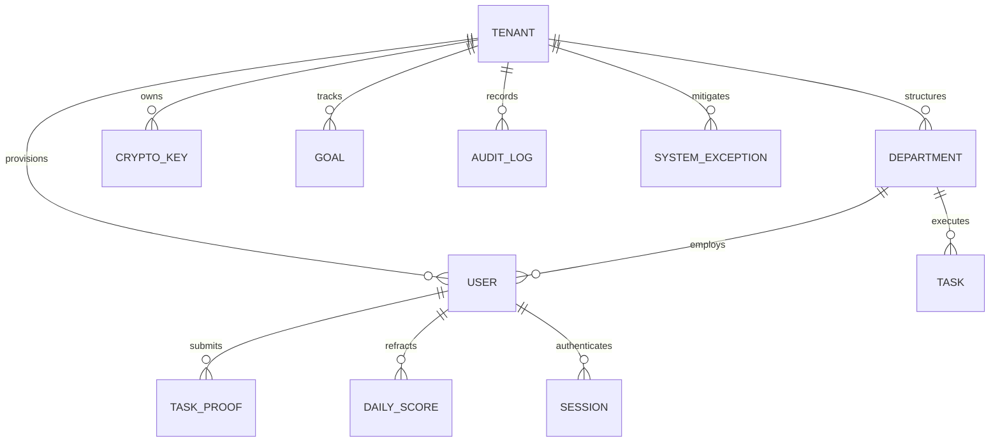

# PRISM Multi-Tenant Enterprise SaaS Specification & Governance Requirements

**Document Version:** 3.0-SAAS  
**Status:** Approved for Engineering Execution  
**Authors:** Executive Council (CEO, Lead Business Analyst, Principal Project Manager, Agile Scrum Master)  
**Target Architecture:** Multi-Tenant Enterprise B2B SaaS Platform (Tenant = Organization)  
**Primary Reference Organization:** `Axiora Technologies Inc.` (`axiora-corp`)

---

## 1. Executive Summary & CEO Strategic Vision

### 1.1 Strategic Vision & Market Positioning
PRISM is engineered as the premier **Autonomous Business Operating System (AI-BOS)** for modern, high-velocity enterprises. By refactoring traditional subjective performance reviews into continuous, cryptographic, proof-backed telemetry, PRISM provides C-suite executives and organization leaders with real-time refraction of workforce velocity, capital efficiency, single-point-of-failure risk, and team wellbeing.

In this transition to a pure B2B Multi-Tenant SaaS platform:
1. **The Fundamental Unit of Multi-Tenancy is the Organization (Tenant)**. Every tenant represents an isolated corporate entity with dedicated cryptographic keyrings, department hierarchies, access control policies, custom KPI formulas, and immutable audit ledgers.
2. **Platform Super Administration vs. Tenant Administration**:
   - **Platform Super Admin (PRISM Core)**: Global controls over tenant provisioning, licensing tiers, compute quota limits, platform health telemetry, and global billing.
   - **Organization/Tenant Admin (Enterprise Customer)**: Full administrative authority over organization structure, user provisioning, SAML/SSO enforcement, role delegations, department budgets, and DPDP/GDPR compliance policies.
3. **Demo Ecosystem Unification**: All legacy demo profiles (`Aarav Sharma - CEO`, `Priya Patel - VP Product`, `Arjun Sharma - Lead Architect`, `Ravi Verma - Senior Developer`, `Neha Gupta`, `Vikram Singh`, etc.) are formally merged under the flagship enterprise demo tenant: **`Axiora Technologies Inc.` (`axiora.prism.ai` / `axiora-corp`)**.

---

### 1.2 SaaS Monetization, Tiers & Quota Governance

| Metric / Capability | Starter Tier (Seed/Small) | Growth Tier (Mid-Market) | Enterprise Sovereign (Fortune 500) |
| :--- | :--- | :--- | :--- |
| **Target Organization Size** | 10 – 50 Employees | 51 – 500 Employees | 500 – 50,000+ Employees |
| **Seat Ceiling** | Up to 50 Seats | Up to 500 Seats | Unlimited / Custom Quota |
| **Proof-of-Work Storage** | 50 GB Encrypted S3 | 500 GB Dedicated Bucket | Multi-Region Sovereign S3 Bucket |
| **AI Luminary Compute** | 10,000 tokens/seat/mo | 100,000 tokens/seat/mo | Dedicated LLM Instance / Bring-Your-Own-Key |
| **Tenant Isolation Model** | Logical Schema + Tenant ID | Logical Schema + Row-Level Security | Virtual Private Cloud (VPC) / Dedicated DB |
| **SAML 2.0 / OIDC SSO** | Google / Microsoft OAuth | Okta, Azure AD, OneLogin | Custom Identity Provider + SCIM 2.0 |
| **Cryptographic Key Shredding**| Shared Master KMS | Tenant KMS Keyring | BYOK (AWS KMS / HashiCorp Vault) |
| **Audit Ledger Retention** | 90 Days | 365 Days | 7 Years (SOC2 Type II + DPDP 2023 Compliant) |

---

## 2. Business Analyst (BA) System Specification

### 2.1 Domain Model & Entity Relationships
Every database query and API operation in the PRISM ecosystem is strictly scoped to `tenant_id`. Data access without a verified `tenant_id` claims payload is automatically rejected at the API Gateway middleware layer.



### 2.2 User Role & Authorization Matrix (RBAC + ABAC)

| Functional Capability | Super Admin (Platform) | Organization Admin (CEO/HR) | Department Head (VP/Director) | Lead / Delegate (Manager) | Employee (IC) | External Auditor |
| :--- | :---: | :---: | :---: | :---: | :---: | :---: |
| **Tenant Provisioning & Suspension** | ✅ Full | ❌ No | ❌ No | ❌ No | ❌ No | ❌ No |
| **Organization Settings & Billing** | ✅ Full | ✅ Full | ❌ No | ❌ No | ❌ No | ❌ No |
| **SSO / SAML & Security Policies** | ✅ Full | ✅ Full | ❌ No | ❌ No | ❌ No | ❌ No |
| **User Onboarding & Department Structuring** | ✅ Full | ✅ Full | ⚠️ Dept Scope | ❌ No | ❌ No | ❌ No |
| **9-Box Calibration & Salary Reviews** | ❌ No | ✅ Full | ⚠️ Dept Scope | ❌ No | ❌ No | ❌ No |
| **Objective / KPI Setting** | ❌ No | ✅ Org-wide | ✅ Dept-wide | ✅ Team-wide | ⚠️ Self Goal | 👁️ Read-only |
| **Proof-of-Work Review & Sign-Off** | ❌ No | ✅ Full | ✅ Dept Scope | ✅ Assigned Scope | ❌ No | 👁️ Read-only |
| **Task Creation & Orbit Kanban** | ❌ No | ✅ Full | ✅ Full | ✅ Full | ✅ Assigned | 👁️ Read-only |
| **Cryptographic Key Shredding (DPDP §28)**| ⚠️ Emergency | ✅ Tenant Scope | ❌ No | ❌ No | ❌ No | ❌ No |
| **Immutable Audit Log Inspection** | ✅ System-wide| ✅ Tenant Scope | ❌ No | ❌ No | ❌ No | ✅ Read-only |

---

### 2.3 Tenant Admin Console (`/admin` / `Tenant Command Center`)
The Tenant Admin Console provides comprehensive controls across 6 core pillars:

1. **Organization Profile & White-Labeling**:
   - Organization Legal Name, Primary Contact, Corporate Subdomain (`<org>.prism.ai`).
   - Corporate Logo, Primary Accent Color, Custom Favicon, Corporate Timezone.
2. **Member & Seat Provisioning**:
   - Real-time seat allocation gauge (`Seats Allocated / Total Licensed Seats`).
   - Bulk CSV Import, SCIM 2.0 automatic directory sync, single-click invitation dispatch.
   - Deactivation, Role Elevation, Temporary Delegate Assignment for leave continuity.
3. **Department Hierarchy & Budget Allocations**:
   - Multi-level department tree with designated Department Heads and Continuity Delegates.
   - Cost center assignment, cloud compute quotas, and revenue contribution targets.
4. **Security, Authentication & DPDP Compliance**:
   - Enforce MFA (TOTP / Hardware Security Key) across privileged roles.
   - Session timeout duration (15m, 30m, 1h, 8h) and concurrent login limits.
   - IP Whitelisting / CIDR restriction for high-security environments.
   - Right-to-Erasure (DPDP §12) and Cryptographic Master Key Shredding console.
5. **Telemetry Calibration & Spectral Weights**:
   - Custom weighting algorithms for 6 spectral lenses:
     $$\text{PVI} = w_1(\text{Output}) + w_2(\text{Growth}) + w_3(\text{Motivation}) + w_4(\text{Wellbeing}) + w_5(\text{Return}) - w_6(\text{Risk})$$
   - Automatic anomaly sensitivity thresholds and flight-risk early alert triggers.
6. **Billing, Invoicing & Usage Telemetry**:
   - Active plan tier, billing cycle (Monthly / Annual), payment methods via Stripe/Paddle.
   - Live metering of AI tokens consumed, document storage, and API ingress calls.

---

### 2.4 Axiora Technologies Demo Tenant Configuration
```json
{
  "tenant_id": "axiora-corp",
  "name": "Axiora Technologies Inc.",
  "subdomain": "axiora",
  "status": "active",
  "tier": "enterprise_sovereign",
  "seat_limit": 500,
  "allocated_seats": 12,
  "settings": {
    "default_timezone": "Asia/Kolkata",
    "mfa_required_roles": ["owner", "dept_head", "delegate"],
    "max_proof_file_size_mb": 50,
    "auto_escalation_hours": 24,
    "ai_luminary_enabled": true,
    "scoring_weights": {
      "output": 0.25,
      "growth": 0.20,
      "motivation": 0.15,
      "wellbeing": 0.15,
      "return": 0.15,
      "risk": 0.10
    }
  },
  "roster": [
    { "email": "ceo@axiora.com", "name": "Aarav Sharma", "role": "owner", "title": "Chief Executive Officer" },
    { "email": "priya@axiora.com", "name": "Priya Patel", "role": "dept_head", "title": "VP of Product & Design" },
    { "email": "arjun@axiora.com", "name": "Arjun Sharma", "role": "delegate", "title": "Lead Software Architect" },
    { "email": "ravi@axiora.com", "name": "Ravi Verma", "role": "employee", "title": "Senior Backend Developer" },
    { "email": "neha@axiora.com", "name": "Neha Gupta", "role": "employee", "title": "Senior Product Designer" },
    { "email": "vikram@axiora.com", "name": "Vikram Singh", "role": "employee", "title": "DevOps Engineer" },
    { "email": "kavya@axiora.com", "name": "Kavya Reddy", "role": "employee", "title": "Growth Marketing Lead" },
    { "email": "rohan@axiora.com", "name": "Rohan Mehta", "role": "employee", "title": "Product Operations Lead" }
  ]
}
```

---

## 3. Project Manager (PM) Execution Strategy

### 3.1 Work Breakdown Structure (WBS) & Milestones

```
Phase 1: Multi-Tenant Architecture & Data Model Migration (Weeks 1–2)
├── T-1.1: Database schema migration for organization tenant boundaries
├── T-1.2: Axiora Technologies seed migration & legacy demo account merger
└── T-1.3: Tenant context middleware with JWT claim verification

Phase 2: SaaS Tenant Admin Console & Provisioning Engine (Weeks 3–4)
├── T-2.1: Tenant Admin dashboard UI with live seat usage and department builder
├── T-2.2: User invitation workflow with secure OTP and Magic Link dispatch
└── T-2.3: Security & DPDP compliance controls (MFA enforcement, IP whitelist)

Phase 3: Telemetry Isolation, Custom Formulas & Billing (Weeks 5–6)
├── T-3.1: Tenant-scoped Spectral Telemetry calculation worker
├── T-3.2: Custom KPI formula weight builder with dynamic validation
└── T-3.3: Usage metering engine (AI tokens, storage bytes, API ingress)

Phase 4: Enterprise Hardening, Verification & Launch (Weeks 7–8)
├── T-4.1: Multi-tenant penetration testing & cross-tenant data leak audits
├── T-4.2: End-to-end automated testing for tenant onboarding and lifecycle
└── T-4.3: Production Netlify/Cloudflare deployment and DNS subdomain routing
```

### 3.2 Enterprise Risk Matrix

| Risk Event | Severity | Probability | Mitigation Strategy |
| :--- | :---: | :---: | :--- |
| **Cross-Tenant Data Leakage** | Critical | Low | Strict ORM row-level tenant filters + automated CI integration test asserting zero cross-tenant leakage. |
| **Noisy Neighbor Performance Degrade** | High | Medium | Tenant-level Redis rate limiting (1,000 req/min base) and isolated worker queues for AI telemetry. |
| **Key Management Compromise** | Critical | Low | Per-tenant AES-256 GCM key derivation. Master key shredding renders all tenant PII unrecoverable within 100ms. |
| **User Confusion during Demo Switch** | Low | Low | Unified Axiora demo switcher with instant role toggles and transparent visual tenant badge. |

---

## 4. Scrum Master Sprint Backlog & User Stories

### Epic 1: SaaS Multi-Tenancy & Tenant Admin Console

#### Story PRISM-101: Organization Tenant Model & Axiora Demo Merger
- **As a** Platform Operator
- **I want** all demo accounts consolidated under the `Axiora Technologies Inc.` organization
- **So that** prospective enterprise buyers evaluate PRISM within a realistic multi-tenant SaaS organization structure.
- **Story Points:** 5 (Medium) | **Priority:** P0 (Must Have)
- **Acceptance Criteria (Gherkin):**
  ```gherkin
  Scenario: Authenticating into Axiora Demo Environment
    Given a user selects any demo profile ("Aarav Sharma", "Priya Patel", "Arjun Sharma")
    When the login request is processed
    Then the JWT payload contains "tenantId": "axiora-corp" and "orgName": "Axiora Technologies Inc."
    And the Top Header displays the organization name with "Luminary Operational Grid Active"
    And all team members, departments, and tasks belong strictly to "axiora-corp"
  ```

---

#### Story PRISM-102: Tenant Administration Dashboard & Member Management
- **As an** Organization Admin (e.g., Aarav Sharma - CEO)
- **I want** a dedicated Tenant Admin Console (`/admin` / `Tenant Command Center`)
- **So that** I can provision new employees, assign department hierarchies, manage licenses, and configure security policies.
- **Story Points:** 8 (Large) | **Priority:** P0 (Must Have)
- **Acceptance Criteria (Gherkin):**
  ```gherkin
  Scenario: Organization Admin provisions a new employee
    Given the Organization Admin navigates to the Tenant Admin Console
    When they enter the employee name, email, department, and role
    And click "Dispatch Invite"
    Then a new user record is created with the current "tenantId"
    And the licensed seat allocation counter increments by 1
    And an audit log entry is written with action "USER_PROVISIONED"
  ```

---

#### Story PRISM-103: Dynamic Spectral Weighting & Tenant Calibration
- **As an** Organization Admin
- **I want** to customize the mathematical weighting of the 6 spectral lenses
- **So that** PRISM calculates composite scores according to our corporate performance philosophy.
- **Story Points:** 5 (Medium) | **Priority:** P1 (Should Have)
- **Acceptance Criteria (Gherkin):**
  ```gherkin
  Scenario: Updating Spectral Weights
    Given the Admin adjusts Output weight to 30% and Wellbeing to 20%
    When the weights total exactly 100%
    And the Admin clicks "Apply Spectral Weights"
    Then the tenant configuration record is updated
    And subsequent composite score calculations immediately reflect the new formula
  ```

---

#### Story PRISM-104: Cryptographic Tenant Data Shredding (DPDP Compliance)
- **As a** Tenant Data Protection Officer
- **I want** an immutable cryptographic key shredding mechanism
- **So that** upon contractual termination, all organization data is irreversibly destroyed without impacting other tenants.
- **Story Points:** 8 (Large) | **Priority:** P1 (Should Have)
- **Acceptance Criteria (Gherkin):**
  ```gherkin
  Scenario: Executing Tenant Cryptographic Shred
    Given the Admin inputs the verification code "CONFIRM_CRYPTO_SHRED_TENANT"
    When the shredding request is confirmed
    Then the tenant master key material in "crypto_keys" is overwritten with null bytes
    And all encrypted employee proofs become mathematically irrecoverable
    And the tenant status changes to "shredded_suspended"
  ```

---

## 5. Definition of Ready (DoR) & Definition of Done (DoD)

### Definition of Ready (DoR)
1. User story contains a clear business rationale, user persona, and story point estimate.
2. Acceptance criteria written in strict Given-When-Then format.
3. UI wireframes and design system tokens referenced.
4. Security and multi-tenant isolation dependencies identified.

### Definition of Done (DoD)
1. **Zero Cross-Tenant Leakage**: Unit and integration tests verify queries are filtered by `tenantId`.
2. **Clean TypeScript Build**: `npm run build` completes with 0 errors and 0 warnings.
3. **Audit Trail Completeness**: All administrative mutations write an append-only entry to the audit ledger.
4. **Performance Benchmark**: Tenant dashboard p95 load time under 400ms.
5. **Peer Review**: Approved by at least 1 Senior Engineer and Product Manager.
