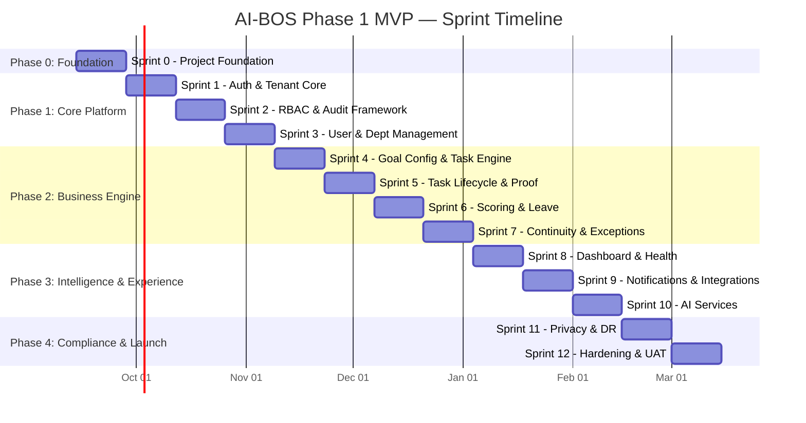
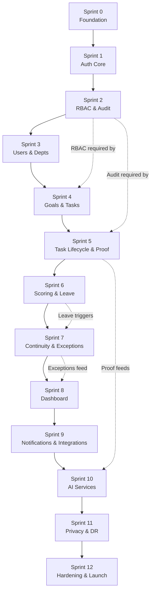

# AI BUSINESS OPERATING SYSTEM (AI-BOS)
## Detailed Sprint Plan — Phase 1 MVP Build
**Author:** CTO & Project Manager  
**Status:** Draft for Review & Approval  
**Methodology:** Agile Scrum (2-week sprints)  
**Total Duration:** 26 weeks (13 sprints) · September 2026 — March 2027  
**Derived From:** PRD v3.2 · FRD v1.3 · TRD v1.0  

---

> [!IMPORTANT]
> **Planning Principle**: This sprint plan sequences work strictly along the FRD dependency chain: `RBAC/Auth → Goal/Priority → Task Engine → Proof → Scoring → Exceptions → Continuity → Dashboard → Notifications → AI`. Every sprint deliverable is a vertically integrated, testable slice — never a backend-only or frontend-only delivery.

---

## 1. Program Overview

### 1.1 Build Phases

### 1.2 Key Milestones

| Milestone | Sprint | Date (Target) | Gate Criteria |
|-----------|--------|---------------|---------------|
| **M0: Foundation Complete** | End of Sprint 0 | Sep 27, 2026 | CI/CD pipeline operational; database schema deployed to staging; design system storybook published |
| **M1: Auth & Security Baseline** | End of Sprint 2 | Nov 8, 2026 | User login + MFA functional; RBAC enforced on all API endpoints; audit logging operational |
| **M2: Core Loop Functional** | End of Sprint 5 | Dec 20, 2026 | Complete task lifecycle: create → assign → submit proof → approve → complete (with score) |
| **M3: Operating Engine Complete** | End of Sprint 7 | Jan 17, 2027 | Leave → continuity reassignment → exception detection → dashboard visibility (full closed loop) |
| **M4: Intelligence Layer Live** | End of Sprint 10 | Feb 28, 2027 | Dashboard with AI summary; notifications via WhatsApp + email; anomaly flagging operational |
| **M5: MVP Launch Ready** | End of Sprint 12 | Mar 28, 2027 | All FRD requirements verified; DPDP compliance controls operational; security audit passed; UAT signed off |

---

## 2. Team Composition

### 2.1 Core Team (12 Members)

| Role | Count | Responsibility |
|------|-------|---------------|
| **Tech Lead / Architect** | 1 | Architecture decisions, code reviews, unblocking, sprint-level technical planning |
| **Senior Backend Engineer** | 2 | API development, domain logic, database, integrations |
| **Senior Frontend Engineer** | 2 | React UI, state management, responsive design, accessibility |
| **Mid Backend Engineer** | 1 | API endpoints, background workers, testing |
| **Mid Frontend Engineer** | 1 | Component development, dashboard widgets, forms |
| **DevOps / SRE Engineer** | 1 | CI/CD, infrastructure, monitoring, DR procedures |
| **QA Engineer** | 2 | Test strategy, automation (E2E + API), manual testing, regression |
| **UI/UX Designer** | 1 | Wireframes, prototypes, design system, user testing |
| **Product Owner / BA** | 1 | Backlog grooming, acceptance criteria, stakeholder communication |

### 2.2 Supporting Roles (Part-Time / On-Call)

| Role | Engagement | Responsibility |
|------|-----------|---------------|
| **Security Engineer** | Sprint 0, 2, 11-12 (full-time); on-call otherwise | Security architecture review, penetration testing, compliance verification |
| **DBA** | Sprint 0, 4, 11 (part-time) | Schema optimization, RLS policy review, backup strategy |
| **Legal / Compliance Advisor** | Sprint 0, 11 (consultation) | DPDP compliance sign-off, DPA review, retention period finalization |

---

## 3. Sprint Velocity Assumptions

| Parameter | Value | Rationale |
|-----------|-------|-----------|
| **Sprint Duration** | 2 weeks (10 working days) | Industry standard for agile cadence |
| **Story Points per Sprint** | 60–80 SP (team total) | Based on 12-person team, accounting for ceremonies and reviews |
| **Point Scale** | Fibonacci: 1, 2, 3, 5, 8, 13 | Standard complexity estimation |
| **Ceremony Time** | ~15% of sprint capacity | Sprint planning, daily standups, reviews, retrospectives |
| **Buffer** | 20% capacity reserved per sprint | Technical debt, unplanned bugs, scope discovery |
| **Definition of Done** | See §3.1 below | Applies to every user story |

### 3.1 Definition of Done (DoD)

Every user story must satisfy ALL of the following before marking complete:

- [ ] Code complete with TypeScript strict mode (no `any` types)
- [ ] Unit tests written (≥ 80% coverage for new code)
- [ ] Integration tests for API endpoints
- [ ] Code reviewed and approved by at least 1 peer + Tech Lead
- [ ] RBAC authorization verified (correct role can access; unauthorized role is blocked)
- [ ] Tenant isolation verified (no cross-tenant data leakage)
- [ ] Audit log event emitted for all state-changing operations
- [ ] API documentation (OpenAPI spec) updated
- [ ] UI responsive on desktop (1280px+) and tablet (768px+)
- [ ] No critical or high severity lint/security findings
- [ ] Deployed to staging and smoke-tested
- [ ] Product Owner acceptance confirmed

---

## 4. Dependency Map

---

## 5. Detailed Sprint Plans

---

### PHASE 0: FOUNDATION

---

### Sprint 0 — Project Foundation & Infrastructure
**Dates:** Sep 14 – Sep 27, 2026  
**Sprint Goal:** *Establish the complete development infrastructure, CI/CD pipeline, database foundation, and design system so that feature development can begin immediately in Sprint 1.*  
**Capacity:** 65 SP

#### Workstream A: DevOps & Infrastructure (DevOps + Tech Lead)

| # | Story | SP | Acceptance Criteria | TRD Ref |
|---|-------|----|---------------------|---------|
| S0-01 | **Set up Git repository** with branch strategy (main → develop → feature/*) | 2 | Repo created; branch protection rules enforced; PR template configured | §13 |
| S0-02 | **Configure CI pipeline** (lint → test → SAST → build → container scan) | 8 | GitHub Actions / GitLab CI runs on every PR; all gates pass on empty project | §13.1, §13.2 |
| S0-03 | **Provision staging environment** via Terraform (VPC, subnets, ALB, ECS/Cloud Run, RDS, Redis, S3) | 13 | Staging infra provisioned; health endpoint returns 200; IaC in version control | §3.1, §3.2, §3.3 |
| S0-04 | **Configure CD pipeline** (staging auto-deploy on develop merge) | 5 | Merge to `develop` triggers automatic staging deployment within 10 minutes | §13.1 |
| S0-05 | **Set up observability stack** (structured logging, metrics, health endpoints) | 5 | `/health` and `/health/ready` endpoints functional; structured JSON logs visible in log aggregator | §10.1, §10.4 |
| S0-06 | **Configure secrets management** (AWS Secrets Manager / GCP Secret Manager) | 3 | Database credentials, API keys injected via env vars at container startup; no secrets in code | §7.3 |

#### Workstream B: Backend Foundation (Backend Engineers)

| # | Story | SP | Acceptance Criteria | TRD Ref |
|---|-------|----|---------------------|---------|
| S0-07 | **Scaffold backend project** (NestJS / Express + TypeScript, project structure with domain module folders) | 5 | Project builds and runs locally; module folder structure matches TRD §2.1 domain modules | §2.1, §15.1 |
| S0-08 | **Configure database connection** with connection pooling and RLS setup | 5 | PostgreSQL connection pool configured; RLS policies created on base tables; `SET LOCAL` tenant context verified | §4.1, §4.2 |
| S0-09 | **Create base database schema** (tenants, users, departments, audit_log tables with constraints) | 8 | Migrations run successfully; tenant table created; audit_log INSERT-only role verified; RLS policies active | §4.3, §4.4 |
| S0-10 | **Implement audit logging middleware** (append-only, captures actor/action/timestamp/resource) | 5 | Every test API call generates an audit record; UPDATE/DELETE on audit_log rejected by DB | §4.4, FR-AUDIT-001, FR-AUDIT-002 |
| S0-11 | **Implement tenant context middleware** (extracts tenant_id from JWT, sets RLS context) | 3 | Middleware sets `app.current_tenant` per request; cross-tenant queries return 0 rows | §4.2 |

#### Workstream C: Frontend Foundation (Frontend Engineers + Designer)

| # | Story | SP | Acceptance Criteria | TRD Ref |
|---|-------|----|---------------------|---------|
| S0-12 | **Scaffold frontend project** (React 19 + TypeScript + Vite + TanStack Query + Zustand) | 3 | Project builds and serves locally; hot reload functional | §15.1 |
| S0-13 | **Create design system** (color palette, typography, spacing, component tokens using Tailwind + Radix UI) | 8 | Design tokens defined; Storybook published with Button, Input, Card, Modal, Badge, Alert primitives | §15.1 |
| S0-14 | **Implement responsive layout shell** (sidebar navigation, top bar, content area, mobile drawer) | 5 | Layout renders correctly at 1280px, 1024px, 768px breakpoints; navigation shell functional | — |
| S0-15 | **Configure API client layer** (Axios/Fetch wrapper with JWT interceptor, error handling, TanStack Query setup) | 3 | API client auto-attaches Bearer token; 401 triggers refresh flow; error toasts display | §5.1 |

**Sprint 0 Deliverables:**
- ✅ CI/CD pipeline fully operational
- ✅ Staging environment provisioned and accessible
- ✅ Backend project with database, RLS, and audit middleware
- ✅ Frontend project with design system and layout shell
- ✅ Observability and secrets management configured

---

### PHASE 1: CORE PLATFORM

---

### Sprint 1 — Authentication & Tenant Management
**Dates:** Sep 28 – Oct 11, 2026  
**Sprint Goal:** *Users can register a tenant, log in with email/password, complete MFA verification (Owner/Delegate), and manage their sessions.*  
**Capacity:** 70 SP

#### Backend Stories

| # | Story | SP | Acceptance Criteria | FRD Ref |
|---|-------|----|---------------------|---------|
| S1-01 | **Implement user registration & tenant onboarding** flow | 8 | Owner can create a new tenant with business name; first user auto-assigned Owner role; tenant settings initialized | FR-GOAL-001 |
| S1-02 | **Implement email/password login** with Argon2id hashing | 5 | User can log in with correct credentials; incorrect password returns 401; password hashed with Argon2id cost ≥ 12 | FR-SEC-001 |
| S1-03 | **Implement MFA (Email OTP)** — send, verify, enforce | 8 | 6-digit OTP sent via email; OTP valid for 5 minutes, single-use; MFA mandatory for Owner/Delegate; optional for Employee | FR-SEC-001 |
| S1-04 | **Implement MFA (SMS OTP)** as alternate delivery channel | 5 | OTP delivered via SMS gateway; same validation rules as email OTP | FR-SEC-001 |
| S1-05 | **Implement JWT token architecture** (access + refresh tokens) | 8 | Access token (RS256, 15-min); refresh token (HttpOnly cookie, 7-day); refresh endpoint issues new access token | TRD §6.2 |
| S1-06 | **Implement brute-force protection** (failed attempt lockout) | 3 | 5 failed login attempts → 15-minute lockout; account holder notified; lockout event audit-logged | FR-SEC-006 |
| S1-07 | **Implement session management** (list, remote sign-out) | 5 | User can view active sessions with device/IP metadata; can terminate any own session remotely | FR-SEC-002, FR-SEC-003 |
| S1-08 | **Implement password policy enforcement** | 3 | Min 12 chars, complexity rules enforced; last 5 passwords cannot be reused; HaveIBeenPwned check on set/change | TRD §6.5 |

#### Frontend Stories

| # | Story | SP | Acceptance Criteria | FRD Ref |
|---|-------|----|---------------------|---------|
| S1-09 | **Build Login page** (email + password form, error states) | 5 | Login form with validation; error messages for invalid credentials and locked accounts | FR-SEC-001 |
| S1-10 | **Build MFA verification page** (OTP input, resend, countdown timer) | 5 | OTP input (6 digits); resend button with cooldown; countdown timer showing OTP expiry | FR-SEC-001 |
| S1-11 | **Build Tenant onboarding flow** (business name, owner profile) | 5 | Multi-step onboarding wizard; creates tenant and owner user; redirects to dashboard | FR-GOAL-001 |
| S1-12 | **Build Active Sessions management page** | 3 | Lists all sessions with device info; "Sign Out" action per session; current session highlighted | FR-SEC-003 |
| S1-13 | **Build Password Reset flow** (request → email → reset) | 3 | Forgot password → email link → reset form; token expires in 1 hour | — |

#### QA Stories

| # | Story | SP | Acceptance Criteria |
|---|-------|----|---------------------|
| S1-14 | **Write auth E2E tests** (login, MFA, lockout, session management) | 5 | E2E suite covers: happy path login, MFA flow, lockout after 5 failures, session termination |

---

### Sprint 2 — RBAC, Authorization & Audit Framework
**Dates:** Oct 12 – Oct 25, 2026  
**Sprint Goal:** *Role-based access control enforced on every API endpoint; audit logging captures all state-changing events; org-wide MFA toggle functional.*  
**Capacity:** 70 SP

#### Backend Stories

| # | Story | SP | Acceptance Criteria | FRD Ref |
|---|-------|----|---------------------|---------|
| S2-01 | **Implement RBAC middleware** (role + scope validation on every endpoint) | 8 | Guard decorator validates `role` and `department_id` scope; unauthorized requests return 403 with reason | FR-RBAC-001, FR-RBAC-003 |
| S2-02 | **Implement Owner → Delegate permission grant** | 5 | Owner can promote Employee to Delegate (scoped to department); permission change audit-logged | FR-RBAC-003, FR-GOAL-003 |
| S2-03 | **Implement org-wide MFA toggle** (Owner-controlled) | 3 | Owner can enable/disable mandatory MFA for all employees; toggle change audit-logged | FR-SEC-001 |
| S2-04 | **Implement step-up authentication** for privileged operations | 5 | Data export, bulk deletion, permission changes require re-authentication regardless of session state | FR-SEC-002 |
| S2-05 | **Implement audit log query API** (Owner-only, filtered, paginated) | 5 | `GET /api/v1/audit` returns paginated audit records; filterable by actor, action, resource, date range; Owner-only access | FR-AUDIT-001 |
| S2-06 | **Implement concurrent session limit** (max 5 per user) | 3 | 6th login terminates oldest session; user notified of terminated session | TRD §6.4 |
| S2-07 | **Implement configurable session timeout** | 3 | Inactivity timeout configurable per tenant (default 30 min); absolute session lifetime 24 hours | FR-SEC-002 |
| S2-08 | **Implement rate limiting middleware** (per-user + per-tenant) | 5 | 100 req/min per user; 1000 req/min per tenant; rate-exceeded returns 429 with Retry-After header | FR-SEC-004 |

#### Frontend Stories

| # | Story | SP | Acceptance Criteria | FRD Ref |
|---|-------|----|---------------------|---------|
| S2-09 | **Build Settings: Security page** (MFA toggle, session timeout config) | 5 | Owner can toggle org-wide MFA; configure session timeout; changes saved and audit-logged | FR-SEC-001 |
| S2-10 | **Build Audit Log viewer** (table with filters, pagination) | 8 | Filterable table showing audit records; pagination; export to CSV; Owner-only visibility | FR-AUDIT-001 |
| S2-11 | **Implement step-up auth modal** (re-enter password for sensitive actions) | 3 | Modal appears before privileged actions; password verified; action proceeds on success | FR-SEC-002 |
| S2-12 | **Implement role-based UI rendering** (hide/show features per role) | 5 | Components conditionally render based on user role; no UI for unauthorized features | FR-RBAC-001 |

#### QA Stories

| # | Story | SP | Acceptance Criteria |
|---|-------|----|---------------------|
| S2-13 | **Write RBAC test suite** (positive + negative authorization tests for all roles) | 8 | API tests for Owner, Delegate, Employee accessing each endpoint; cross-tenant requests return 0/403 |
| S2-14 | **Write tenant isolation test suite** | 5 | Create 2 tenants; verify no data leakage between them across all existing endpoints |

---

### Sprint 3 — User Management & Department Configuration
**Dates:** Oct 26 – Nov 8, 2026  
**Sprint Goal:** *Owners can invite and manage users, create departments, and configure the organizational structure that the Task Engine will operate on.*  
**Capacity:** 70 SP

#### Backend Stories

| # | Story | SP | Acceptance Criteria | FRD Ref |
|---|-------|----|---------------------|---------|
| S3-01 | **Implement user invitation flow** (email invite → set password → onboard) | 8 | Owner/Delegate can invite users by email; invited user sets password; auto-assigned Employee role | — |
| S3-02 | **Implement user CRUD operations** (create, read, update, deactivate) | 5 | Full user management; deactivation (not deletion) preserves audit trail; all changes audit-logged | — |
| S3-03 | **Implement department CRUD** with priority weighting | 5 | Owner creates departments with names; assigns numeric priority weights (must sum to 100%); weights audit-logged | FR-GOAL-002, FR-GOAL-006 |
| S3-04 | **Implement user-department assignment** | 3 | Users assigned to exactly one department; assignment change audit-logged | — |
| S3-05 | **Implement backup employee configuration** per user/role | 5 | Owner/Delegate configures pre-approved backup list per employee; backup assignments stored and audit-logged | FR-CONT-002 |
| S3-06 | **Implement employee profile API** (own data view with score placeholder) | 3 | Employee can view their own profile, department, backup config; score section shows placeholder | FR-SCORE-006 |

#### Frontend Stories

| # | Story | SP | Acceptance Criteria | FRD Ref |
|---|-------|----|---------------------|---------|
| S3-07 | **Build Team Management page** (user list, invite, role management) | 8 | Table of users with role, department, status; invite button; role change dropdown (Owner only) | — |
| S3-08 | **Build User Invitation modal** (email input, role selection) | 3 | Modal with email field, role selector, department selector; sends invitation email | — |
| S3-09 | **Build Department Management page** (CRUD + priority weight editor) | 8 | Department list with editable priority weights; visual weight distribution bar; save triggers audit | FR-GOAL-002 |
| S3-10 | **Build Backup Configuration page** (per employee backup list editor) | 5 | Select pre-approved backups from team members; drag-to-reorder priority; save backup list | FR-CONT-002 |
| S3-11 | **Build Employee Profile page** (own data, department, score placeholder) | 5 | Personal profile view; department info; placeholder score card; account settings | FR-SCORE-006 |

#### QA Stories

| # | Story | SP | Acceptance Criteria |
|---|-------|----|---------------------|
| S3-12 | **Write user management test suite** | 5 | Tests for invite flow, role changes, deactivation, cross-tenant isolation of user data |
| S3-13 | **Write department/priority test suite** | 3 | Tests for CRUD, weight validation (must sum to 100%), priority change audit logging |

> [!NOTE]
> **Milestone M1: Auth & Security Baseline — Gate Review at end of Sprint 2**

---

### PHASE 2: BUSINESS ENGINE

---

### Sprint 4 — Goal Configuration & Task Engine (Creation & Assignment)
**Dates:** Nov 9 – Nov 22, 2026  
**Sprint Goal:** *Owners can set business goals; tasks can be created, assigned, and accepted by employees with all required fields and validation.*  
**Capacity:** 75 SP

#### Backend Stories

| # | Story | SP | Acceptance Criteria | FRD Ref |
|---|-------|----|---------------------|---------|
| S4-01 | **Implement Goal CRUD API** (create, read, update, delete business goals) | 5 | Owner can manage revenue targets and business goals; all changes audit-logged with prior/new values | FR-GOAL-001, FR-GOAL-006 |
| S4-02 | **Implement Task creation API** with required field validation | 8 | Required fields enforced: title, department, assignee, due date/SLA, proof type, proof description; incomplete submission rejected with field-level reason | FR-TASK-001, FR-TASK-002, FR-TASK-005 |
| S4-03 | **Implement task state machine** (Created → Assigned → Accepted → InProgress) | 8 | State transitions validated; invalid transitions rejected; every transition audit-logged with state history record | FR-TASK-008 |
| S4-04 | **Implement task priority derivation** from department weighting | 3 | New task inherits department priority weight; optional priority override field (Owner/Delegate only); override audit-logged | FR-GOAL-007, FR-TASK-003 |
| S4-05 | **Implement "Lead Follow-up" task category** with default proof requirement | 3 | Tasks tagged "Lead Follow-up" default proof requirement to payment/conversion record; configurable by Owner | FR-TASK-004 |
| S4-06 | **Implement task assignment & reassignment** (manual by Owner/Delegate) | 5 | Owner/Delegate can assign/reassign tasks; Employee cannot change assignee; changes audit-logged | FR-TASK-006, FR-TASK-007 |
| S4-07 | **Implement task modification rules** (pre-proof vs. post-proof constraints) | 5 | Before proof submission: Owner/Delegate can modify all fields. After proof: modification requires reason, audit-logged | FR-TASK-009, FR-TASK-010 |
| S4-08 | **Implement task cancellation** with mandatory reason | 3 | Owner/Delegate can cancel tasks; reason required; cancellation audit-logged; cancelled tasks excluded from future scoring denominators | FR-TASK-008, FR-SCORE-009 |

#### Frontend Stories

| # | Story | SP | Acceptance Criteria | FRD Ref |
|---|-------|----|---------------------|---------|
| S4-09 | **Build Goal Configuration page** (business goals + department priorities) | 5 | Goal management interface; create/edit/delete goals; priority weight editor integrated | FR-GOAL-001 |
| S4-10 | **Build Task Creation form** (multi-step with field validation) | 8 | Form with all required fields; proof type selector; department auto-populates from assignee; validation errors shown inline | FR-TASK-002 |
| S4-11 | **Build Task List view** (filterable table/kanban with status badges) | 8 | Task list filterable by department, assignee, status, priority; status badges color-coded; pagination | FR-TASK-008 |
| S4-12 | **Build Task Detail view** (full info + state history + action buttons) | 5 | Task detail page showing all fields, state history timeline, and contextual action buttons (Accept, Start, Cancel) | FR-TASK-008 |

#### QA Stories

| # | Story | SP | Acceptance Criteria |
|---|-------|----|---------------------|
| S4-13 | **Write task engine test suite** (creation, validation, state transitions, RBAC) | 8 | API tests for all task operations; state machine transition tests (valid + invalid); RBAC enforcement verified |

---

### Sprint 5 — Task Lifecycle Completion & Proof Submission
**Dates:** Nov 23 – Dec 6, 2026  
**Sprint Goal:** *Employees can submit proof against tasks; Managers/Owners can review and approve/reject proof; tasks can reach Completed state only with approved proof.*  
**Capacity:** 75 SP

#### Backend Stories

| # | Story | SP | Acceptance Criteria | FRD Ref |
|---|-------|----|---------------------|---------|
| S5-01 | **Implement proof submission API** with file upload to object storage | 8 | Employee uploads proof (file/structured data/checklist); file stored in S3/GCS with SSE-CMK; immutable server timestamp injected; proof record created | FR-PROOF-002, FR-PROOF-003 |
| S5-02 | **Implement proof type validation** (document, structured data, checklist, ticket reference) | 5 | Each proof type validates required sub-fields; incomplete proof rejected with field-level reason | FR-PROOF-001, FR-PROOF-003 |
| S5-03 | **Implement proof approval/rejection** workflow | 5 | Delegate/Owner approves or rejects proof; rejection requires mandatory reason; rejection notifies submitter; task state transitions accordingly | FR-PROOF-004, FR-PROOF-005 |
| S5-04 | **Implement structured proof match-rule validation** | 5 | Structured proofs (e.g., payment reference) checked against match rules; pass → auto-validate; fail → route to manual review with failure reason | FR-PROOF-009 |
| S5-05 | **Implement proof-gated task completion** constraint | 5 | Task state `Completed` is UNREACHABLE without an approved proof record; DB trigger enforces this; any attempt to bypass returns error | FR-TASK-012, FR-TASK-011 |
| S5-06 | **Implement proof resubmission** flow (Needs Correction → re-upload) | 3 | After rejection, task moves to NeedsCorrection; employee can re-submit new proof; cycle repeats until approval | FR-PROOF-005 |
| S5-07 | **Implement pre-signed URL generation** for proof file access | 3 | Proof files accessible only via pre-signed URLs; URLs expire in 15 minutes; no public bucket access | TRD §3.3 |

#### Frontend Stories

| # | Story | SP | Acceptance Criteria | FRD Ref |
|---|-------|----|---------------------|---------|
| S5-08 | **Build Proof Submission interface** (file upload, structured data forms, checklist UI) | 8 | Upload component with drag-and-drop; structured data form with dynamic fields per proof type; checklist with multi-item verification | FR-PROOF-002 |
| S5-09 | **Build Proof Review Queue** (list of pending proofs for Delegate/Owner) | 8 | Filterable queue showing pending proofs; proof preview (image/PDF viewer); approve/reject buttons; rejection reason modal | FR-PROOF-004 |
| S5-10 | **Build Proof Detail view** (submission data + match-rule validation results + anomaly flags placeholder) | 5 | Proof detail showing submitted data, timestamps, validation results, reviewer actions, and state history | FR-PROOF-009 |
| S5-11 | **Update Task Detail** to show proof submission status and linked proof records | 3 | Task detail shows linked proof submissions with status badges; action button context-aware (Submit Proof / View Proof / Re-submit) | FR-TASK-008 |

#### QA Stories

| # | Story | SP | Acceptance Criteria |
|---|-------|----|---------------------|
| S5-12 | **Write proof engine test suite** (upload, validation, approval, rejection, resubmission, proof-gate) | 8 | Full lifecycle tests; proof-gated completion enforced; file upload/download via pre-signed URLs; RBAC for approval |
| S5-13 | **Write end-to-end core loop test** (create task → assign → submit proof → approve → complete) | 5 | E2E test covers the entire happy path from task creation to completion with proof |

> [!NOTE]
> **Milestone M2: Core Loop Functional — Gate Review at end of Sprint 5**

---

### Sprint 6 — Scoring Engine & Leave Management
**Dates:** Dec 7 – Dec 20, 2026  
**Sprint Goal:** *Mechanical scoring (completion % and SLA adherence %) calculated automatically; employees can request leave; scores visible with full factor breakdown and dispute capability.*  
**Capacity:** 75 SP

#### Backend Stories

| # | Story | SP | Acceptance Criteria | FRD Ref |
|---|-------|----|---------------------|---------|
| S6-01 | **Implement Task Completion % calculation** | 8 | `completion_pct = completed_with_proof / eligible_assigned`; recalculated on every task state change; respects denominator exclusion rules (cancelled, reassigned, not yet due) | FR-SCORE-001, FR-SCORE-003, FR-SCORE-009 |
| S6-02 | **Implement SLA Adherence % calculation** | 5 | `sla_adherence_pct = on_time / past_due_total`; missed SLA permanently recorded even if task later completed; respects exclusion rules | FR-SCORE-002, FR-SCORE-004, FR-SCORE-009 |
| S6-03 | **Implement Score Snapshot persistence** (historical per period) | 5 | Scores saved as immutable snapshots per evaluation period; corrections create new snapshots with references, never overwrite | FR-SCORE-008 |
| S6-04 | **Implement Score API** (own score, team scores, all scores per role) | 5 | Employee sees own score only; Delegate sees team scores; Owner sees all; full factor breakdown included | FR-SCORE-006, FR-RBAC-001 |
| S6-05 | **Implement Score Dispute** flow (flag → Delegate review → Owner escalation) | 5 | Employee flags score; enters Delegate review queue; 48-hour auto-escalation to Owner; resolution triggers recalculation; audit-logged | FR-SCORE-007 |
| S6-06 | **Implement Leave Request** CRUD (submit, approve, reject) | 5 | Employee/Delegate submits leave request with date range; Delegate/Owner approves/rejects; approved leave sets user status to Unavailable; all changes audit-logged | FR-LEAVE-001..003, FR-LEAVE-006 |
| S6-07 | **Implement Return from Leave** status reversion | 3 | On leave end date, user status reverts to Available; reassigned tasks remain with backup (no auto-reassign back) | FR-LEAVE-005 |

#### Frontend Stories

| # | Story | SP | Acceptance Criteria | FRD Ref |
|---|-------|----|---------------------|---------|
| S6-08 | **Build Score Dashboard component** (completion %, SLA adherence %, factor breakdown) | 8 | Score card with gauges/charts; factor breakdown table; period selector; "Flag for Review" button for employees | FR-SCORE-006 |
| S6-09 | **Build Score Dispute flow** (flag modal, review queue for Delegate/Owner) | 5 | Employee can flag with reason; Delegate sees dispute queue; resolution modal (uphold/correct with reason) | FR-SCORE-007 |
| S6-10 | **Build Leave Management page** (request, calendar view, approval queue) | 8 | Leave request form with date picker; calendar showing team availability; approval queue for Delegate/Owner | FR-LEAVE-001..002 |
| S6-11 | **Update Employee Profile** to show live score with factor breakdown | 3 | Profile page shows current and historical scores with drill-down into contributing tasks | FR-SCORE-006 |

#### QA Stories

| # | Story | SP | Acceptance Criteria |
|---|-------|----|---------------------|
| S6-12 | **Write scoring engine test suite** (formulas, exclusion rules, snapshots, disputes) | 8 | Tests for completion %, SLA %; denominator exclusion rules (cancelled, reassigned, not yet due); snapshot immutability; dispute lifecycle |
| S6-13 | **Write leave management test suite** | 3 | Tests for leave request lifecycle; status change; return-from-leave behavior |

---

### Sprint 7 — Continuity Engine & Exception Detection
**Dates:** Dec 21, 2026 – Jan 3, 2027  
**Sprint Goal:** *Approved leave automatically triggers task reassignment to pre-approved backups; exceptions (missed SLA, missing proof, continuity risks) are detected and surfaced.*  
**Capacity:** 70 SP

#### Backend Stories

| # | Story | SP | Acceptance Criteria | FRD Ref |
|---|-------|----|---------------------|---------|
| S7-01 | **Implement Continuity Engine event processor** (leave.approved → identify affected tasks) | 8 | Leave approval event triggers identification of all active tasks assigned to unavailable employee | FR-CONT-001, FR-CONT-002 |
| S7-02 | **Implement backup selection algorithm** (pre-approved only, lowest task load) | 8 | 1 backup → auto-reassign. Multiple → select lowest open-task load. None → escalate as unresolved exception. Cascade if selected backup also unavailable. | FR-CONT-002 |
| S7-03 | **Implement automatic task reassignment** on continuity trigger | 5 | Assignee field changed; proof/due date preserved unless manually adjusted; original assignee history retained; new assignee notified; audit-logged with reason, prior/new assignee | FR-CONT-004 |
| S7-04 | **Implement continuity failure escalation** | 3 | If no backup resolves within configurable window, task flagged as top-priority "Unresolved Continuity Exception" | FR-CONT-006 |
| S7-05 | **Implement Exception Detection engine** (SLA missed, proof missing past due, overdue, blocked, unavailable) | 8 | System detects all exception types; each timestamped and categorized by severity; routed to responsible Delegate/Owner | FR-EXC-001, FR-EXC-002 |
| S7-06 | **Implement exception escalation** (unresolved past threshold → Owner) | 3 | Configurable threshold; unresolved exception auto-escalates to Owner regardless of original assignee | FR-EXC-004 |
| S7-07 | **Implement exception resolution API** (Owner/Delegate resolves exceptions) | 3 | Exception marked as resolved with action taken; resolution audit-logged | FR-EXC-003 |
| S7-08 | **Implement overdue task high-priority reassignment** | 2 | Overdue tasks reassigned immediately with high-priority tag; original SLA breach preserved on record | FR-CONT-002 |

#### Frontend Stories

| # | Story | SP | Acceptance Criteria | FRD Ref |
|---|-------|----|---------------------|---------|
| S7-09 | **Build Exception Queue view** (filterable list with severity badges + 1-click actions) | 8 | Exception list with severity color-coding; filter by type, department, status; "Resolve" action with reason modal | FR-EXC-003 |
| S7-10 | **Build Continuity Events view** (reassignment timeline + unresolved items) | 5 | Timeline showing continuity events; unresolved items highlighted with urgent styling | FR-CONT-006 |
| S7-11 | **Update Task Detail** to show reassignment history and continuity context | 3 | Task detail shows reassignment chain (original → backup) with timestamps and reasons | FR-CONT-004 |

#### QA Stories

| # | Story | SP | Acceptance Criteria |
|---|-------|----|---------------------|
| S7-12 | **Write continuity engine test suite** (single backup, multiple, none, cascade, overdue) | 8 | Full backup selection algorithm tested; cascade tested; escalation on no-backup tested; scoring denominator exclusion for reassigned tasks verified |
| S7-13 | **Write exception detection test suite** (all exception types + escalation) | 5 | Each exception type detected; severity classification correct; escalation after threshold; resolution audit-logged |

> [!NOTE]
> **Milestone M3: Operating Engine Complete — Gate Review at end of Sprint 7**

---

### PHASE 3: INTELLIGENCE & EXPERIENCE

---

### Sprint 8 — Owner Dashboard & Health Monitoring
**Dates:** Jan 4 – Jan 17, 2027  
**Sprint Goal:** *Owner Dashboard displays business health indicator, open exceptions, task summaries, continuity status, and team scores with drill-down capability.*  
**Capacity:** 75 SP

#### Backend Stories

| # | Story | SP | Acceptance Criteria | FRD Ref |
|---|-------|----|---------------------|---------|
| S8-01 | **Implement Business Health API** (aggregate exception count/severity → Green/Yellow/Red) | 5 | Health status derived from open exception count and severity; configurable thresholds; returns color + contributing factors | FR-DASH-001 |
| S8-02 | **Implement Dashboard Summary API** (task counts by state, department breakdown) | 5 | Returns: assigned, in-progress, completed, overdue counts at business and department level | FR-DASH-003 |
| S8-03 | **Implement Continuity Summary API** (active reassignments, unresolved items) | 3 | Returns active reassignment count, unresolved continuity exceptions, days since oldest unresolved | FR-DASH-004 |
| S8-04 | **Implement Team Score Summary API** (completion %, SLA per department/individual) | 5 | Returns score breakdowns per department with drill-down to individuals; respects RBAC scoping | FR-DASH-005 |
| S8-05 | **Implement dashboard caching layer** (Redis, 60s TTL, event-driven invalidation) | 5 | Dashboard API responses cached; cache invalidated on task/proof/exception state changes | TRD §11.3 |
| S8-06 | **Implement Delegate Dashboard API** (team-scoped version of Owner Dashboard) | 3 | Delegate sees same widget structure but scoped to their team/department only | FR-RBAC-001 |

#### Frontend Stories

| # | Story | SP | Acceptance Criteria | FRD Ref |
|---|-------|----|---------------------|---------|
| S8-07 | **Build Owner Dashboard layout** (widget grid with health indicator, exceptions, tasks, scores) | 13 | Dashboard with: health status card (color-coded), exception count, task summary, continuity status, team scores; auto-refresh every 60s | FR-DASH-001..005 |
| S8-08 | **Build drill-down flow** (summary → department → individual) | 8 | Click on department → department detail; click on individual → employee detail; back navigation; actionable items from drill-down (reassign, resolve, approve) | FR-DASH-007 |
| S8-09 | **Build Delegate Dashboard** (team-scoped version) | 5 | Same widget structure as Owner Dashboard but scoped to Delegate's department | FR-RBAC-001 |
| S8-10 | **Build Employee Dashboard** (personal tasks, score, proof status, dispute status) | 8 | Employee landing page with: my tasks, my score with factor breakdown, my proof submission status, my open disputes | FR-SCORE-006 |

#### QA Stories

| # | Story | SP | Acceptance Criteria |
|---|-------|----|---------------------|
| S8-11 | **Write dashboard test suite** (data accuracy, RBAC scoping, cache invalidation) | 8 | Dashboard numbers match underlying data; Delegate sees only team data; Employee sees only own data; cache refreshes after state changes |
| S8-12 | **Write cross-role dashboard verification tests** | 3 | Same business event verified across Owner, Delegate, and Employee dashboards; each sees appropriate scope |

---

### Sprint 9 — Notifications, Escalations & Integrations
**Dates:** Jan 18 – Jan 31, 2027  
**Sprint Goal:** *All notification events are triggered and delivered via in-app, WhatsApp, and email channels with proper fallback behavior and data minimization.*  
**Capacity:** 75 SP

#### Backend Stories

| # | Story | SP | Acceptance Criteria | FRD Ref |
|---|-------|----|---------------------|---------|
| S9-01 | **Implement Notification Event Registry** (all FR-NOTIF events mapped to templates) | 5 | All 9 notification events (FR-NOTIF-001..009) registered with template text, severity, and target actor | FR-NOTIF-001..009 |
| S9-02 | **Implement In-App Notification system** (notification inbox, mark-as-read) | 5 | Notifications stored in DB; API for list/mark-read; real-time delivery via WebSocket or polling | FR-NOTIF-001..009 |
| S9-03 | **Implement WhatsApp Business API integration** (send notifications via BSP) | 8 | WhatsApp notifications sent for configured events; template messages pre-approved; minimal data sent (no proof/scores) | FR-NOTIF-009, FRD §20.1 |
| S9-04 | **Implement Email notification integration** (transactional emails via SES/SendGrid) | 5 | Email notifications sent with SPF/DKIM/DMARC; minimal content per data minimization rules | FRD §20.2 |
| S9-05 | **Implement notification fallback chain** (WhatsApp → Email → In-App) | 5 | If WhatsApp fails after 3 retries, falls back to email; if email fails, in-app notification created; delivery failure logged | FRD §20.1, §20.2 |
| S9-06 | **Implement circuit breaker pattern** for all external integrations | 5 | Circuit opens after 5 consecutive failures; half-open after 60s; metrics emitted for each integration | TRD §9.1 |
| S9-07 | **Implement notification preferences API** (per-user channel configuration) | 3 | Users can configure preferred notification channel; Owner can set defaults; preferences audit-logged | — |
| S9-08 | **Implement SLA warning notification** (configurable lead time before due date) | 3 | Notification sent to assignee and Delegate when SLA warning threshold reached | FR-NOTIF-003 |

#### Frontend Stories

| # | Story | SP | Acceptance Criteria | FRD Ref |
|---|-------|----|---------------------|---------|
| S9-09 | **Build Notification Inbox** (in-app notification panel/drawer) | 8 | Notification bell with unread count; dropdown/drawer showing recent notifications; mark-as-read; click navigates to relevant resource | FR-NOTIF-001..009 |
| S9-10 | **Build Notification Preferences page** (per-user channel settings) | 5 | Toggle WhatsApp/email/in-app per notification type; save preferences | — |
| S9-11 | **Build Integration Settings page** (WhatsApp/Email configuration for Owner) | 5 | WhatsApp connection setup; email configuration; test send button; integration status indicators | — |

#### QA Stories

| # | Story | SP | Acceptance Criteria |
|---|-------|----|---------------------|
| S9-12 | **Write notification test suite** (all events, all channels, fallback, data minimization) | 8 | All 9 notification events tested; WhatsApp → Email → In-App fallback verified; external notifications contain no proof/score detail |
| S9-13 | **Write integration resilience tests** (circuit breaker, retry, timeout) | 5 | Circuit breaker opens/closes correctly; retries respect exponential backoff; timeouts don't block core loop |

---

### Sprint 10 — AI Services (Anomaly Flagging & Intelligent Daily Summary)
**Dates:** Feb 1 – Feb 14, 2027  
**Sprint Goal:** *Proof Anomaly Flagging detects suspicious proof submissions; Intelligent Daily Summary generates a narrative digest for the Owner; AI calibration feedback captured.*  
**Capacity:** 75 SP

#### Backend Stories

| # | Story | SP | Acceptance Criteria | FRD Ref |
|---|-------|----|---------------------|---------|
| S10-01 | **Implement Proof Anomaly Flagging pipeline** (async, event-driven) | 13 | On `proof.submitted` event: run duplicate check (pHash/SHA-256), timing analysis, historical comparison; generate flag with reason + confidence (0.0–1.0); attach to proof record; non-blocking (30s timeout → proceed without flag) | FR-PROOF-008, FRD §13.1 |
| S10-02 | **Implement anomaly flag confidence scoring** and visual deprioritization | 3 | Flags below 0.5 confidence deprioritized in UI but never hidden; flags include human-readable reason | PRD §3.5 |
| S10-03 | **Implement Intelligent Daily Summary generation** | 8 | Scheduled daily job aggregates 24h events; sends pseudonymized data to LLM API; returns narrative summary; summary cached in Redis (24h TTL); on-demand regeneration supported | FR-DASH-006, FRD §13.2 |
| S10-04 | **Implement LLM data minimization** (pseudonymize before sending) | 5 | Employee names/IDs mapped to pseudonyms before LLM call; no PII sent externally; structured data only; DPA terms verified | TRD §8.2, FR-NOTIF-009 |
| S10-05 | **Implement AI summary fallback** (raw data if LLM fails) | 3 | If LLM API fails, dashboard shows structured data widgets (exception count, task summary, continuity) instead of narrative | FRD §13.2 |
| S10-06 | **Implement AI Calibration Feedback API** (accept/dismiss anomaly flags) | 5 | Owner/Delegate can accept or dismiss flags; dismissal accepts optional reason; decision logged with original AI output reference; per-tenant calibration record stored | FR-CAL-001..004 |
| S10-07 | **Implement AI Governance controls** (model version tracking, tenant-scoped calibration) | 3 | Every AI output stores model/config version; calibration data tenant-scoped; no cross-tenant influence | TRD §8.3, FR-CAL-004 |
| S10-08 | **Implement Daily Summary delivery** via WhatsApp/Email (aggregate only) | 3 | Summary delivered to Owner via configured channel; external delivery contains aggregate health only, no employee-identifying detail | FR-NOTIF-008, FR-NOTIF-009 |

#### Frontend Stories

| # | Story | SP | Acceptance Criteria | FRD Ref |
|---|-------|----|---------------------|---------|
| S10-09 | **Build AI Anomaly Flags queue** (flagged proofs with confidence + reason + accept/dismiss) | 8 | Flags list with confidence badges (color-coded); reason text; accept/dismiss buttons; dismissal reason modal; low-confidence flags visually deprioritized | FR-PROOF-008, FR-CAL-001 |
| S10-10 | **Build Intelligent Daily Summary widget** on Owner Dashboard | 5 | Narrative summary card on dashboard; "Regenerate" button for on-demand; loading state; fallback to raw data on failure | FR-DASH-006 |
| S10-11 | **Update Proof Review Queue** to show anomaly flag badges and details | 3 | Proof queue items show flag indicator; flag detail expandable with reason and confidence score | FR-PROOF-008 |

#### QA Stories

| # | Story | SP | Acceptance Criteria |
|---|-------|----|---------------------|
| S10-12 | **Write anomaly flagging test suite** (duplicate, timing, historical, non-blocking, confidence) | 8 | Duplicate proof flagged; rapid submission flagged; pipeline timeout doesn't block proof; confidence scores within expected range |
| S10-13 | **Write AI summary test suite** (generation, fallback, data minimization, caching) | 5 | Summary generated correctly; fallback on LLM failure; no PII in LLM request payload; cache invalidation on regenerate |

> [!NOTE]
> **Milestone M4: Intelligence Layer Live — Gate Review at end of Sprint 10**

---

### PHASE 4: COMPLIANCE & LAUNCH

---

### Sprint 11 — Privacy (DPDP Compliance) & Disaster Recovery
**Dates:** Feb 15 – Feb 28, 2027  
**Sprint Goal:** *DPDP Act 2023 compliance controls operational (data access, correction, deletion requests); DR procedures documented, automated, and tested.*  
**Capacity:** 70 SP

#### Backend Stories

| # | Story | SP | Acceptance Criteria | FRD Ref |
|---|-------|----|---------------------|---------|
| S11-01 | **Implement Privacy Request API** (data access, correction, deletion) | 8 | Any authenticated user can submit privacy request for own data; request lifecycle: submitted → under review → approved/rejected (with reason) → fulfilled; audit-logged | FR-PRIV-001..003 |
| S11-02 | **Implement Data Access Request fulfillment** (generate downloadable export) | 5 | On approval, system generates JSON/CSV export of requester's personal data; download link provided (pre-signed, 24h expiry) | FR-PRIV-001 |
| S11-03 | **Implement Data Deletion / Anonymization** logic | 8 | On deletion approval: PII fields anonymized per TRD §14.3 spec; proof files deleted from object storage; metadata hashes retained for audit integrity; audit log records anonymized but retained | FR-PRIV-003 |
| S11-04 | **Implement Data Retention enforcement** job (nightly automated) | 5 | Nightly job checks retention periods per data type; data past retention anonymized/deleted; configurable periods stored as tenant settings | FR-PRIV-004 |
| S11-05 | **Implement Purpose Limitation enforcement** (module-scoped data access) | 3 | Cross-module data access logged; proof data accessible only by Proof, Scoring, and AI modules; unauthorized cross-module queries blocked | FR-PRIV-006 |
| S11-06 | **Implement Data Export logging** as privacy-relevant audit event | 2 | Every data export (Owner-only) logged as distinct privacy audit event | FR-PRIV-007 |
| S11-07 | **Implement Deletion Ledger** for backup propagation | 5 | Fulfilled deletion requests recorded in `deletion_ledger`; post-restore job processes ledger and re-applies anonymizations | TRD §12.4 |
| S11-08 | **Implement DR backup automation** (cross-region snapshots, WAL archiving) | 5 | Automated daily PostgreSQL snapshots to DR region; WAL archiving for PITR; object storage cross-region replication enabled; Redis RDB snapshots exported | FR-DR-001, FR-DR-004 |
| S11-09 | **Create DR Runbook** and execute first DR drill | 5 | Documented runbook with step-by-step restore procedure; first drill executed; results documented with data integrity verification | FR-DR-002, FR-DR-005 |
| S11-10 | **Implement incident notification generation** system | 3 | System can generate and send bulk tenant/user notifications in a declared incident; template-based; audit-logged | FR-DR-006 |

#### Frontend Stories

| # | Story | SP | Acceptance Criteria | FRD Ref |
|---|-------|----|---------------------|---------|
| S11-11 | **Build Privacy Request page** (submit access/correction/deletion request) | 5 | Request form with type selector; submission confirmation; status tracking; download link for fulfilled access requests | FR-PRIV-001..003 |
| S11-12 | **Build Privacy Request Management** (Owner review queue) | 5 | Owner sees pending privacy requests; approve/reject with reason; fulfillment status tracking | FR-PRIV-001..003 |

#### QA Stories

| # | Story | SP | Acceptance Criteria |
|---|-------|----|---------------------|
| S11-13 | **Write DPDP compliance test suite** (access, correction, deletion, retention, anonymization) | 8 | Full privacy request lifecycle tested; anonymization verified (no PII recoverable post-deletion); audit records retained but anonymized; retention job tested |
| S11-14 | **Write DR verification test suite** | 5 | Backup restore tested; data integrity verified; tenant isolation confirmed post-restore; core loop smoke test passes on restored environment |

---

### Sprint 12 — Security Hardening, Performance & UAT
**Dates:** Mar 1 – Mar 14, 2027  
**Sprint Goal:** *Security hardening complete; performance targets met; comprehensive UAT executed; all critical/high findings remediated; production deployment pipeline validated.*  
**Capacity:** 70 SP

#### Security Hardening Stories

| # | Story | SP | Acceptance Criteria | TRD Ref |
|---|-------|----|---------------------|---------|
| S12-01 | **Execute SAST/DAST security scan** and remediate findings | 8 | SonarQube/Semgrep SAST: zero critical/high findings. OWASP ZAP DAST: zero critical/high findings. | §13.2 |
| S12-02 | **Conduct penetration test** (internal or contracted) | 5 | Pen test report with zero critical findings. Medium findings documented with remediation timeline. | §7 |
| S12-03 | **Verify all security headers** and CSP policy | 3 | HSTS, X-Content-Type-Options, X-Frame-Options, CSP all correctly set; verified via security header scanner | §7.4 |
| S12-04 | **Verify tenant isolation under adversarial conditions** | 5 | Attempt cross-tenant access via: direct API, modified JWT, SQL injection, error responses. All return zero cross-tenant data. | §4.2, FR-SEC-005 |
| S12-05 | **Verify WAF rules and rate limiting** in staging | 3 | OWASP Top 10 rule set blocking; rate limits enforced; bot detection functional | §7.4 |

#### Performance Stories

| # | Story | SP | Acceptance Criteria | TRD Ref |
|---|-------|----|---------------------|---------|
| S12-06 | **Execute load testing** (k6 or Artillery) against staging | 5 | API p95 < 300ms at 100 RPS; dashboard load < 2s; no errors under normal load; graceful degradation at 150% load | §11.1 |
| S12-07 | **Optimize slow queries** identified during load testing | 5 | All queries under 100ms at p95; query plans reviewed; missing indexes added | §11.4 |
| S12-08 | **Verify caching layer** effectiveness | 3 | Redis cache hit rate > 80% for dashboard queries; cache invalidation verified within 60s of state change | §11.3 |

#### UAT & Launch Prep Stories

| # | Story | SP | Acceptance Criteria |
|---|-------|----|---------------------|
| S12-09 | **Execute full UAT** (all user journeys with Product Owner) | 13 | All 15 UAT scenarios passed (see §6 below). All core user journeys verified. All passed. |
| S12-10 | **Provision production environment** (Terraform apply with production configs) | 5 | Production VPC, ALB, ECS/Cloud Run, RDS, Redis, S3 provisioned; secrets configured; DNS pointing to ALB | §3 |
| S12-11 | **Execute production deployment dry-run** (blue/green deployment test) | 3 | Deploy to production; health checks pass; rollback tested and functional | §13.2 |
| S12-12 | **Create production monitoring dashboards** (Grafana/CloudWatch) | 3 | Dashboards for: API latency, error rate, DB utilization, Redis memory, background job queue depth, notification delivery rate | §10.2 |
| S12-13 | **Write production runbook** (incident response, escalation, rollback procedures) | 5 | Runbook covers: service restart, database failover, Redis flush, rollback deployment, incident communication template | §12, PRD §13.5 |

> [!NOTE]
> **Milestone M5: MVP Launch Ready — Final Gate Review at end of Sprint 12**

---

## 6. UAT Test Scenarios (Sprint 12)

> [!IMPORTANT]
> UAT scenarios must cover the **complete operating loop** as defined in PRD §1.2, from goal-setting through feedback/calibration.

| # | Scenario | Actors | Expected Outcome | FRD Trace |
|---|----------|--------|-------------------|-----------|
| **UAT-01** | Owner completes onboarding (tenant, profile, departments, goals, priorities) | Owner | Tenant created; departments with weights; goals saved; audit trail complete | FR-GOAL-001..006 |
| **UAT-02** | Owner invites Delegate and Employees; configures backups | Owner, Delegate, Employee | Users onboarded with correct roles; backup assignments saved | FR-CONT-002 |
| **UAT-03** | Delegate creates task with all required fields; Employee accepts | Delegate, Employee | Task created with validation; state transitions: Created → Assigned → Accepted | FR-TASK-001..008 |
| **UAT-04** | Employee submits proof (file upload); Delegate approves; task completes | Employee, Delegate | Proof uploaded with server timestamp; approval transitions task to Completed; score recalculated | FR-PROOF-002..004, FR-TASK-011..012 |
| **UAT-05** | Delegate rejects proof; Employee re-submits; approved on second attempt | Employee, Delegate | Task moves to NeedsCorrection; re-upload accepted; task completes on approval | FR-PROOF-005 |
| **UAT-06** | Task created without proof — verify it CANNOT be marked complete | System | System rejects completion; proof-gate enforced at every layer | FR-TASK-012 |
| **UAT-07** | Employee requests leave; approved; Continuity Engine reassigns tasks | Employee, Delegate, System | Leave approved; active tasks reassigned to lowest-load backup; notifications sent; audit trail complete | FR-CONT-001..004 |
| **UAT-08** | Leave approved but no backup exists — verify escalation | Delegate, Owner | Unresolved continuity exception appears on Owner Dashboard as urgent | FR-CONT-006 |
| **UAT-09** | SLA breach occurs — exception detected and notified | System, Owner | Exception raised; notification sent to assignee, Delegate, and Owner; exception visible on Dashboard | FR-EXC-001, FR-NOTIF-004 |
| **UAT-10** | Owner reviews Dashboard: health, exceptions, scores, summary | Owner | All dashboard widgets populated; drill-down functional; AI summary displays correctly | FR-DASH-001..007 |
| **UAT-11** | Anomaly flag raised on suspicious proof; Owner dismisses with reason | Owner, AI | Flag visible in review queue; dismiss with reason captured; calibration feedback logged | FR-PROOF-008, FR-CAL-001..002 |
| **UAT-12** | Employee disputes score; Delegate reviews; resolution audit-logged | Employee, Delegate | Dispute created; appears in queue; resolution triggers score recalculation; full audit trail | FR-SCORE-007 |
| **UAT-13** | Employee submits data access request; Owner fulfills | Employee, Owner | Privacy request lifecycle completes; data export generated and downloadable | FR-PRIV-001 |
| **UAT-14** | Employee submits data deletion request; Owner fulfills | Employee, Owner | PII anonymized; proof files deleted; audit records retained with anonymized actor; deletion ledger updated | FR-PRIV-003 |
| **UAT-15** | Verify cross-tenant isolation (login as Tenant B, attempt access to Tenant A data) | QA | All API calls return zero data from other tenants; no error message leaks tenant information | FR-SEC-005 |

---

## 7. Risk Register

| # | Risk | Probability | Impact | Mitigation | Owner |
|---|------|------------|--------|------------|-------|
| **R1** | WhatsApp BSP approval delays (template messages) | Medium | High | Start BSP onboarding in Sprint 0; prepare email-only fallback for launch | DevOps |
| **R2** | LLM API latency or availability issues | Medium | Low | Non-blocking architecture; raw data fallback already planned; provider switchable via abstraction | Backend Lead |
| **R3** | DPDP Act compliance uncertainty (anonymization vs. deletion) | Medium | High | Legal consultation in Sprint 0 and Sprint 11; conservative approach (anonymize + document) | Product Owner |
| **R4** | PostgreSQL RLS performance overhead | Low | Medium | Benchmark RLS vs. application-only isolation in Sprint 0; optimize indexes in Sprint 12 | DBA |
| **R5** | Team velocity lower than estimated in early sprints | Medium | Medium | 20% buffer already built into each sprint; scope can be deferred to Sprint 12 buffer | Scrum Master |
| **R6** | Scope creep from stakeholder feature requests | High | Medium | Strict FRD scope boundary (§24 Non-Goals); all requests logged and deferred to Phase 2 backlog | Product Owner |
| **R7** | Cross-tenant data leak in production | Low | Critical | 3-layer isolation; dedicated test suite; adversarial testing in Sprint 12; bug bounty post-launch | Security Engineer |
| **R8** | Cloud provider India region outage | Low | High | Cross-region DR architecture (TRD §12); quarterly DR drills; DNS failover configured | DevOps |

---

## 8. Sprint Ceremony Schedule

| Ceremony | Duration | Timing | Attendees |
|----------|---------|--------|-----------|
| **Sprint Planning** | 2 hours | Day 1 (Monday) of each sprint | Full team |
| **Daily Standup** | 15 minutes | Every day, 10:00 AM IST | Full team |
| **Backlog Refinement** | 1 hour | Day 5 (Friday) of week 1 | PO, Tech Lead, Senior Engineers |
| **Sprint Review / Demo** | 1 hour | Day 10 (Friday) of week 2 | Full team + stakeholders |
| **Sprint Retrospective** | 45 minutes | Day 10 (Friday) after review | Full team |
| **Milestone Gate Review** | 2 hours | At each milestone (M0–M5) | Full team + CTO + Stakeholders |

---

## 9. Release Criteria (MVP Launch Gate — M5)

The following criteria must ALL be satisfied before production launch:

### 9.1 Functional Completeness

- [ ] All 16 FRD modules implemented and verified
- [ ] All 15 UAT scenarios passed by Product Owner
- [ ] Zero known P0 (critical) or P1 (high) defects
- [ ] P2 (medium) defects documented with remediation timeline

### 9.2 Security & Compliance

- [ ] SAST scan: zero critical/high findings
- [ ] DAST scan: zero critical/high findings
- [ ] Penetration test: zero critical findings
- [ ] Tenant isolation: adversarial test suite passes 100%
- [ ] MFA: functional for all Owner/Delegate accounts
- [ ] DPDP privacy workflow: access, correction, deletion operational
- [ ] Audit log: immutability verified (no UPDATE/DELETE possible)
- [ ] All DPAs signed with third-party integrations

### 9.3 Performance & Reliability

- [ ] API p95 latency < 300ms at projected load
- [ ] System uptime > 99.5% over last 2 weeks of staging
- [ ] Dashboard load time < 2 seconds
- [ ] Continuity reassignment < 30 seconds
- [ ] Zero data loss during load testing

### 9.4 Operational Readiness

- [ ] Production environment provisioned and validated
- [ ] CI/CD pipeline deploys to production (blue/green tested)
- [ ] Monitoring dashboards operational
- [ ] Alerting rules configured and tested
- [ ] Production runbook documented
- [ ] DR drill completed with successful restore verified
- [ ] On-call rotation established

---

## 10. Story Point Summary by Sprint

| Sprint | Phase | Total SP | Backend SP | Frontend SP | QA SP | DevOps SP |
|--------|-------|----------|-----------|-------------|-------|-----------|
| **Sprint 0** | Foundation | 65 | 26 | 19 | 0 | 20 |
| **Sprint 1** | Core Platform | 70 | 45 | 21 | 5 | 0 |
| **Sprint 2** | Core Platform | 70 | 37 | 21 | 13 | 0 |
| **Sprint 3** | Core Platform | 70 | 29 | 29 | 8 | 0 |
| **Sprint 4** | Business Engine | 75 | 40 | 26 | 8 | 0 |
| **Sprint 5** | Business Engine | 75 | 34 | 24 | 13 | 0 |
| **Sprint 6** | Business Engine | 75 | 36 | 24 | 11 | 0 |
| **Sprint 7** | Business Engine | 70 | 40 | 16 | 13 | 0 |
| **Sprint 8** | Intelligence | 75 | 26 | 34 | 11 | 0 |
| **Sprint 9** | Intelligence | 75 | 39 | 18 | 13 | 0 |
| **Sprint 10** | Intelligence | 75 | 43 | 16 | 13 | 0 |
| **Sprint 11** | Compliance | 70 | 49 | 10 | 13 | 0 |
| **Sprint 12** | Launch | 70 | 0 | 0 | 13 | 24 |
| **TOTAL** | — | **935 SP** | **444 SP** | **258 SP** | **134 SP** | **44 SP** |

---

## 11. Post-MVP Backlog (Phase 2 Queue)

Items explicitly deferred per FRD §24 (Functional Non-Goals), queued for Phase 2 planning:

| Priority | Feature | PRD Reference |
|----------|---------|---------------|
| P1 | Quality Scoring & Revenue Attribution | PRD §7, §17.2 |
| P2 | WhatsApp Conversational Task Creation | PRD §17.2 |
| P3 | Direction Alignment Scoring | PRD §7 |
| P4 | Promotion / Hike Readiness (AI-assisted) | PRD §7 |
| P5 | Social & Marketing API Integrations | PRD §17.2 |
| P6 | Team Leaderboard (Owner-configurable) | PRD §12 |
| P7 | Advanced ML-Assisted Proof Anomaly Detection | PRD §4.2 |
| P8 | Recruitment & Onboarding Automation | PRD §17.2 |
| P9 | Call Recording & Analysis | PRD §17.2 |
| P10 | Enterprise SSO (SAML/OAuth) | PRD §13.2, §17.3 |

---

*Document Version: Sprint Plan v1.0*  
*Created: September 2026*  
*Next Review: Sprint 0 Kickoff*
